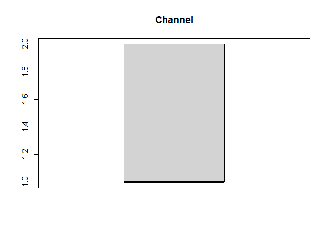
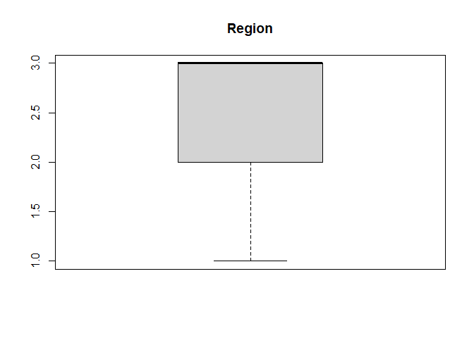
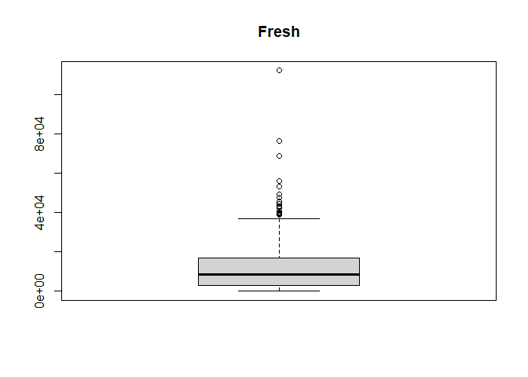
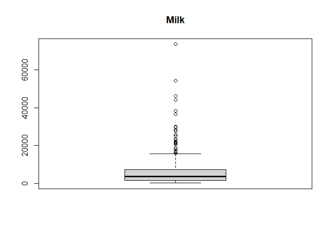
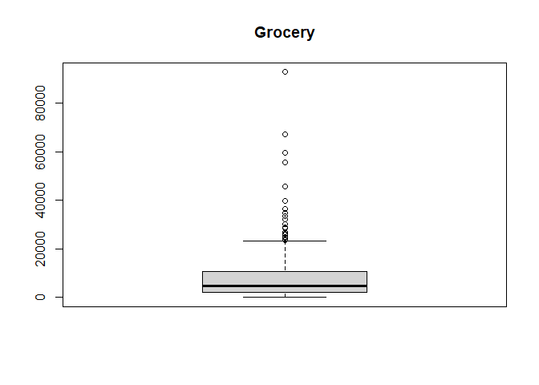
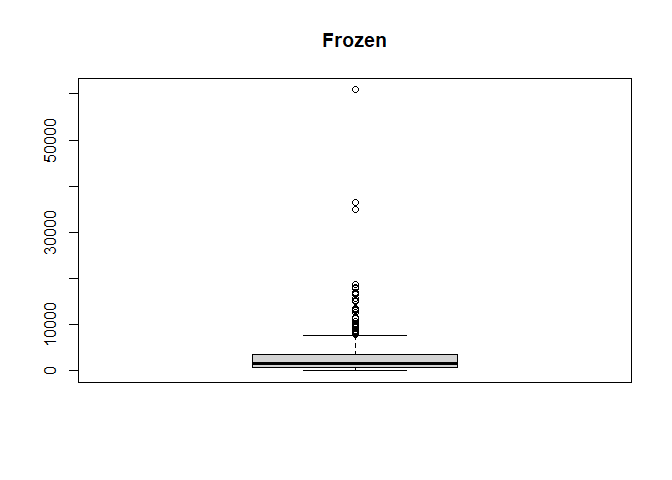
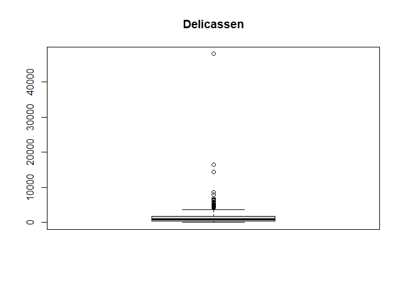

R Notebook
================

``` r
library(readr)
customers_data_2 <- read_csv("C:/Users/Admin/Downloads/Wholesale customers data.csv")
```

    ## 
    ## -- Column specification --------------------------------------------------------
    ## cols(
    ##   Channel = col_double(),
    ##   Region = col_double(),
    ##   Fresh = col_double(),
    ##   Milk = col_double(),
    ##   Grocery = col_double(),
    ##   Frozen = col_double(),
    ##   Detergents_Paper = col_double(),
    ##   Delicassen = col_double()
    ## )

``` r
customers_data <- customers_data_2
head(customers_data)
```

    ## # A tibble: 6 x 8
    ##   Channel Region Fresh  Milk Grocery Frozen Detergents_Paper Delicassen
    ##     <dbl>  <dbl> <dbl> <dbl>   <dbl>  <dbl>            <dbl>      <dbl>
    ## 1       2      3 12669  9656    7561    214             2674       1338
    ## 2       2      3  7057  9810    9568   1762             3293       1776
    ## 3       2      3  6353  8808    7684   2405             3516       7844
    ## 4       1      3 13265  1196    4221   6404              507       1788
    ## 5       2      3 22615  5410    7198   3915             1777       5185
    ## 6       2      3  9413  8259    5126    666             1795       1451

``` r
tail(customers_data)
```

    ## # A tibble: 6 x 8
    ##   Channel Region Fresh  Milk Grocery Frozen Detergents_Paper Delicassen
    ##     <dbl>  <dbl> <dbl> <dbl>   <dbl>  <dbl>            <dbl>      <dbl>
    ## 1       1      3 16731  3922    7994    688             2371        838
    ## 2       1      3 29703 12051   16027  13135              182       2204
    ## 3       1      3 39228  1431     764   4510               93       2346
    ## 4       2      3 14531 15488   30243    437            14841       1867
    ## 5       1      3 10290  1981    2232   1038              168       2125
    ## 6       1      3  2787  1698    2510     65              477         52

``` r
str(customers_data)
```

    ## tibble [440 x 8] (S3: spec_tbl_df/tbl_df/tbl/data.frame)
    ##  $ Channel         : num [1:440] 2 2 2 1 2 2 2 2 1 2 ...
    ##  $ Region          : num [1:440] 3 3 3 3 3 3 3 3 3 3 ...
    ##  $ Fresh           : num [1:440] 12669 7057 6353 13265 22615 ...
    ##  $ Milk            : num [1:440] 9656 9810 8808 1196 5410 ...
    ##  $ Grocery         : num [1:440] 7561 9568 7684 4221 7198 ...
    ##  $ Frozen          : num [1:440] 214 1762 2405 6404 3915 ...
    ##  $ Detergents_Paper: num [1:440] 2674 3293 3516 507 1777 ...
    ##  $ Delicassen      : num [1:440] 1338 1776 7844 1788 5185 ...
    ##  - attr(*, "spec")=
    ##   .. cols(
    ##   ..   Channel = col_double(),
    ##   ..   Region = col_double(),
    ##   ..   Fresh = col_double(),
    ##   ..   Milk = col_double(),
    ##   ..   Grocery = col_double(),
    ##   ..   Frozen = col_double(),
    ##   ..   Detergents_Paper = col_double(),
    ##   ..   Delicassen = col_double()
    ##   .. )

``` r
summary(customers_data)
```

    ##     Channel          Region          Fresh             Milk      
    ##  Min.   :1.000   Min.   :1.000   Min.   :     3   Min.   :   55  
    ##  1st Qu.:1.000   1st Qu.:2.000   1st Qu.:  3128   1st Qu.: 1533  
    ##  Median :1.000   Median :3.000   Median :  8504   Median : 3627  
    ##  Mean   :1.323   Mean   :2.543   Mean   : 12000   Mean   : 5796  
    ##  3rd Qu.:2.000   3rd Qu.:3.000   3rd Qu.: 16934   3rd Qu.: 7190  
    ##  Max.   :2.000   Max.   :3.000   Max.   :112151   Max.   :73498  
    ##     Grocery          Frozen        Detergents_Paper    Delicassen     
    ##  Min.   :    3   Min.   :   25.0   Min.   :    3.0   Min.   :    3.0  
    ##  1st Qu.: 2153   1st Qu.:  742.2   1st Qu.:  256.8   1st Qu.:  408.2  
    ##  Median : 4756   Median : 1526.0   Median :  816.5   Median :  965.5  
    ##  Mean   : 7951   Mean   : 3071.9   Mean   : 2881.5   Mean   : 1524.9  
    ##  3rd Qu.:10656   3rd Qu.: 3554.2   3rd Qu.: 3922.0   3rd Qu.: 1820.2  
    ##  Max.   :92780   Max.   :60869.0   Max.   :40827.0   Max.   :47943.0

``` r
is.null(customers_data)
```

    ## [1] FALSE

``` r
anyDuplicated(customers_data)
```

    ## [1] 0

``` r
# install.packages("magrittr") # package installations are only needed the first time you use it
# install.packages("dplyr")    # alternative installation of the %>%
library(magrittr) # needs to be run every time you start R and want to use %>%
library(dplyr)    # alternatively, this also loads %>%
```

    ## 
    ## Attaching package: 'dplyr'

    ## The following objects are masked from 'package:stats':
    ## 
    ##     filter, lag

    ## The following objects are masked from 'package:base':
    ## 
    ##     intersect, setdiff, setequal, union

``` r
names(customers_data[, 1])
```

    ## [1] "Channel"

``` r
num.cols <- unlist(lapply(customers_data, is.numeric))         
num.cols
```

    ##          Channel           Region            Fresh             Milk 
    ##             TRUE             TRUE             TRUE             TRUE 
    ##          Grocery           Frozen Detergents_Paper       Delicassen 
    ##             TRUE             TRUE             TRUE             TRUE

``` r
# -num.cols- being a condition
data.num <- customers_data[ , num.cols]                        
data.num 
```

    ## # A tibble: 440 x 8
    ##    Channel Region Fresh  Milk Grocery Frozen Detergents_Paper Delicassen
    ##      <dbl>  <dbl> <dbl> <dbl>   <dbl>  <dbl>            <dbl>      <dbl>
    ##  1       2      3 12669  9656    7561    214             2674       1338
    ##  2       2      3  7057  9810    9568   1762             3293       1776
    ##  3       2      3  6353  8808    7684   2405             3516       7844
    ##  4       1      3 13265  1196    4221   6404              507       1788
    ##  5       2      3 22615  5410    7198   3915             1777       5185
    ##  6       2      3  9413  8259    5126    666             1795       1451
    ##  7       2      3 12126  3199    6975    480             3140        545
    ##  8       2      3  7579  4956    9426   1669             3321       2566
    ##  9       1      3  5963  3648    6192    425             1716        750
    ## 10       2      3  6006 11093   18881   1159             7425       2098
    ## # ... with 430 more rows

``` r
for (i in 1:ncol(data.num)) {
  boxplot(data.num[, i], main=names(data.num[, i]))
}
```

<!-- --><!-- --><!-- --><!-- --><!-- --><!-- --><!-- --><!-- -->

``` r
customers_data <- as.tbl(customers_data)
```

    ## Warning: `as.tbl()` is deprecated as of dplyr 1.0.0.
    ## Please use `tibble::as_tibble()` instead.
    ## This warning is displayed once every 8 hours.
    ## Call `lifecycle::last_warnings()` to see where this warning was generated.

``` r
head(customers_data)
```

    ## # A tibble: 6 x 8
    ##   Channel Region Fresh  Milk Grocery Frozen Detergents_Paper Delicassen
    ##     <dbl>  <dbl> <dbl> <dbl>   <dbl>  <dbl>            <dbl>      <dbl>
    ## 1       2      3 12669  9656    7561    214             2674       1338
    ## 2       2      3  7057  9810    9568   1762             3293       1776
    ## 3       2      3  6353  8808    7684   2405             3516       7844
    ## 4       1      3 13265  1196    4221   6404              507       1788
    ## 5       2      3 22615  5410    7198   3915             1777       5185
    ## 6       2      3  9413  8259    5126    666             1795       1451

``` r
customers_data$Channel <- as.character(customers_data$Channel)

customers_data$Channel[customers_data$Channel == "1"] <- "restaurant"
customers_data$Channel[customers_data$Channel == "2"] <- "retail"
```

``` r
customers_data$Region <- as.character(customers_data$Region)

customers_data$Region[customers_data$Region == "1"] <- "Lisbon"
customers_data$Region[customers_data$Region == "2"] <- "Porto"
customers_data$Region[customers_data$Region == "3"] <- "Other region"
```

``` r
customers_data$Region
```

    ##   [1] "Other region" "Other region" "Other region" "Other region" "Other region"
    ##   [6] "Other region" "Other region" "Other region" "Other region" "Other region"
    ##  [11] "Other region" "Other region" "Other region" "Other region" "Other region"
    ##  [16] "Other region" "Other region" "Other region" "Other region" "Other region"
    ##  [21] "Other region" "Other region" "Other region" "Other region" "Other region"
    ##  [26] "Other region" "Other region" "Other region" "Other region" "Other region"
    ##  [31] "Other region" "Other region" "Other region" "Other region" "Other region"
    ##  [36] "Other region" "Other region" "Other region" "Other region" "Other region"
    ##  [41] "Other region" "Other region" "Other region" "Other region" "Other region"
    ##  [46] "Other region" "Other region" "Other region" "Other region" "Other region"
    ##  [51] "Other region" "Other region" "Other region" "Other region" "Other region"
    ##  [56] "Other region" "Other region" "Other region" "Other region" "Other region"
    ##  [61] "Other region" "Other region" "Other region" "Other region" "Other region"
    ##  [66] "Other region" "Other region" "Other region" "Other region" "Other region"
    ##  [71] "Other region" "Other region" "Other region" "Other region" "Other region"
    ##  [76] "Other region" "Other region" "Other region" "Other region" "Other region"
    ##  [81] "Other region" "Other region" "Other region" "Other region" "Other region"
    ##  [86] "Other region" "Other region" "Other region" "Other region" "Other region"
    ##  [91] "Other region" "Other region" "Other region" "Other region" "Other region"
    ##  [96] "Other region" "Other region" "Other region" "Other region" "Other region"
    ## [101] "Other region" "Other region" "Other region" "Other region" "Other region"
    ## [106] "Other region" "Other region" "Other region" "Other region" "Other region"
    ## [111] "Other region" "Other region" "Other region" "Other region" "Other region"
    ## [116] "Other region" "Other region" "Other region" "Other region" "Other region"
    ## [121] "Other region" "Other region" "Other region" "Other region" "Other region"
    ## [126] "Other region" "Other region" "Other region" "Other region" "Other region"
    ## [131] "Other region" "Other region" "Other region" "Other region" "Other region"
    ## [136] "Other region" "Other region" "Other region" "Other region" "Other region"
    ## [141] "Other region" "Other region" "Other region" "Other region" "Other region"
    ## [146] "Other region" "Other region" "Other region" "Other region" "Other region"
    ## [151] "Other region" "Other region" "Other region" "Other region" "Other region"
    ## [156] "Other region" "Other region" "Other region" "Other region" "Other region"
    ## [161] "Other region" "Other region" "Other region" "Other region" "Other region"
    ## [166] "Other region" "Other region" "Other region" "Other region" "Other region"
    ## [171] "Other region" "Other region" "Other region" "Other region" "Other region"
    ## [176] "Other region" "Other region" "Other region" "Other region" "Other region"
    ## [181] "Other region" "Other region" "Other region" "Other region" "Other region"
    ## [186] "Other region" "Other region" "Other region" "Other region" "Other region"
    ## [191] "Other region" "Other region" "Other region" "Other region" "Other region"
    ## [196] "Other region" "Lisbon"       "Lisbon"       "Lisbon"       "Lisbon"      
    ## [201] "Lisbon"       "Lisbon"       "Lisbon"       "Lisbon"       "Lisbon"      
    ## [206] "Lisbon"       "Lisbon"       "Lisbon"       "Lisbon"       "Lisbon"      
    ## [211] "Lisbon"       "Lisbon"       "Lisbon"       "Lisbon"       "Lisbon"      
    ## [216] "Lisbon"       "Lisbon"       "Lisbon"       "Lisbon"       "Lisbon"      
    ## [221] "Lisbon"       "Lisbon"       "Lisbon"       "Lisbon"       "Lisbon"      
    ## [226] "Lisbon"       "Lisbon"       "Lisbon"       "Lisbon"       "Lisbon"      
    ## [231] "Lisbon"       "Lisbon"       "Lisbon"       "Lisbon"       "Lisbon"      
    ## [236] "Lisbon"       "Lisbon"       "Lisbon"       "Lisbon"       "Lisbon"      
    ## [241] "Lisbon"       "Lisbon"       "Lisbon"       "Lisbon"       "Lisbon"      
    ## [246] "Lisbon"       "Lisbon"       "Lisbon"       "Lisbon"       "Lisbon"      
    ## [251] "Lisbon"       "Lisbon"       "Lisbon"       "Lisbon"       "Lisbon"      
    ## [256] "Lisbon"       "Lisbon"       "Lisbon"       "Lisbon"       "Lisbon"      
    ## [261] "Lisbon"       "Lisbon"       "Lisbon"       "Lisbon"       "Lisbon"      
    ## [266] "Lisbon"       "Lisbon"       "Lisbon"       "Lisbon"       "Lisbon"      
    ## [271] "Lisbon"       "Lisbon"       "Lisbon"       "Other region" "Other region"
    ## [276] "Other region" "Other region" "Other region" "Other region" "Other region"
    ## [281] "Other region" "Other region" "Other region" "Other region" "Other region"
    ## [286] "Other region" "Other region" "Other region" "Other region" "Other region"
    ## [291] "Other region" "Other region" "Other region" "Porto"        "Porto"       
    ## [296] "Porto"        "Porto"        "Porto"        "Porto"        "Porto"       
    ## [301] "Porto"        "Porto"        "Porto"        "Porto"        "Porto"       
    ## [306] "Porto"        "Porto"        "Porto"        "Porto"        "Porto"       
    ## [311] "Porto"        "Porto"        "Porto"        "Porto"        "Porto"       
    ## [316] "Porto"        "Porto"        "Porto"        "Porto"        "Porto"       
    ## [321] "Porto"        "Porto"        "Porto"        "Porto"        "Porto"       
    ## [326] "Porto"        "Porto"        "Porto"        "Porto"        "Porto"       
    ## [331] "Porto"        "Porto"        "Porto"        "Porto"        "Porto"       
    ## [336] "Porto"        "Porto"        "Porto"        "Porto"        "Porto"       
    ## [341] "Other region" "Other region" "Other region" "Other region" "Other region"
    ## [346] "Other region" "Other region" "Other region" "Other region" "Other region"
    ## [351] "Other region" "Other region" "Other region" "Other region" "Other region"
    ## [356] "Other region" "Other region" "Other region" "Other region" "Other region"
    ## [361] "Other region" "Other region" "Other region" "Other region" "Other region"
    ## [366] "Other region" "Other region" "Other region" "Other region" "Other region"
    ## [371] "Other region" "Other region" "Other region" "Other region" "Other region"
    ## [376] "Other region" "Other region" "Other region" "Other region" "Other region"
    ## [381] "Other region" "Other region" "Other region" "Other region" "Other region"
    ## [386] "Other region" "Other region" "Other region" "Other region" "Other region"
    ## [391] "Other region" "Other region" "Other region" "Other region" "Other region"
    ## [396] "Other region" "Other region" "Other region" "Other region" "Other region"
    ## [401] "Other region" "Other region" "Other region" "Other region" "Other region"
    ## [406] "Other region" "Other region" "Other region" "Other region" "Other region"
    ## [411] "Other region" "Other region" "Other region" "Other region" "Other region"
    ## [416] "Other region" "Other region" "Other region" "Other region" "Other region"
    ## [421] "Other region" "Other region" "Other region" "Other region" "Other region"
    ## [426] "Other region" "Other region" "Other region" "Other region" "Other region"
    ## [431] "Other region" "Other region" "Other region" "Other region" "Other region"
    ## [436] "Other region" "Other region" "Other region" "Other region" "Other region"

``` r
#colMeans(customers_data)
```

``` r
#var(customers_data)


vec_new <- gsub(" ", "", customers_data$Region)
vec_new
```

    ##   [1] "Otherregion" "Otherregion" "Otherregion" "Otherregion" "Otherregion"
    ##   [6] "Otherregion" "Otherregion" "Otherregion" "Otherregion" "Otherregion"
    ##  [11] "Otherregion" "Otherregion" "Otherregion" "Otherregion" "Otherregion"
    ##  [16] "Otherregion" "Otherregion" "Otherregion" "Otherregion" "Otherregion"
    ##  [21] "Otherregion" "Otherregion" "Otherregion" "Otherregion" "Otherregion"
    ##  [26] "Otherregion" "Otherregion" "Otherregion" "Otherregion" "Otherregion"
    ##  [31] "Otherregion" "Otherregion" "Otherregion" "Otherregion" "Otherregion"
    ##  [36] "Otherregion" "Otherregion" "Otherregion" "Otherregion" "Otherregion"
    ##  [41] "Otherregion" "Otherregion" "Otherregion" "Otherregion" "Otherregion"
    ##  [46] "Otherregion" "Otherregion" "Otherregion" "Otherregion" "Otherregion"
    ##  [51] "Otherregion" "Otherregion" "Otherregion" "Otherregion" "Otherregion"
    ##  [56] "Otherregion" "Otherregion" "Otherregion" "Otherregion" "Otherregion"
    ##  [61] "Otherregion" "Otherregion" "Otherregion" "Otherregion" "Otherregion"
    ##  [66] "Otherregion" "Otherregion" "Otherregion" "Otherregion" "Otherregion"
    ##  [71] "Otherregion" "Otherregion" "Otherregion" "Otherregion" "Otherregion"
    ##  [76] "Otherregion" "Otherregion" "Otherregion" "Otherregion" "Otherregion"
    ##  [81] "Otherregion" "Otherregion" "Otherregion" "Otherregion" "Otherregion"
    ##  [86] "Otherregion" "Otherregion" "Otherregion" "Otherregion" "Otherregion"
    ##  [91] "Otherregion" "Otherregion" "Otherregion" "Otherregion" "Otherregion"
    ##  [96] "Otherregion" "Otherregion" "Otherregion" "Otherregion" "Otherregion"
    ## [101] "Otherregion" "Otherregion" "Otherregion" "Otherregion" "Otherregion"
    ## [106] "Otherregion" "Otherregion" "Otherregion" "Otherregion" "Otherregion"
    ## [111] "Otherregion" "Otherregion" "Otherregion" "Otherregion" "Otherregion"
    ## [116] "Otherregion" "Otherregion" "Otherregion" "Otherregion" "Otherregion"
    ## [121] "Otherregion" "Otherregion" "Otherregion" "Otherregion" "Otherregion"
    ## [126] "Otherregion" "Otherregion" "Otherregion" "Otherregion" "Otherregion"
    ## [131] "Otherregion" "Otherregion" "Otherregion" "Otherregion" "Otherregion"
    ## [136] "Otherregion" "Otherregion" "Otherregion" "Otherregion" "Otherregion"
    ## [141] "Otherregion" "Otherregion" "Otherregion" "Otherregion" "Otherregion"
    ## [146] "Otherregion" "Otherregion" "Otherregion" "Otherregion" "Otherregion"
    ## [151] "Otherregion" "Otherregion" "Otherregion" "Otherregion" "Otherregion"
    ## [156] "Otherregion" "Otherregion" "Otherregion" "Otherregion" "Otherregion"
    ## [161] "Otherregion" "Otherregion" "Otherregion" "Otherregion" "Otherregion"
    ## [166] "Otherregion" "Otherregion" "Otherregion" "Otherregion" "Otherregion"
    ## [171] "Otherregion" "Otherregion" "Otherregion" "Otherregion" "Otherregion"
    ## [176] "Otherregion" "Otherregion" "Otherregion" "Otherregion" "Otherregion"
    ## [181] "Otherregion" "Otherregion" "Otherregion" "Otherregion" "Otherregion"
    ## [186] "Otherregion" "Otherregion" "Otherregion" "Otherregion" "Otherregion"
    ## [191] "Otherregion" "Otherregion" "Otherregion" "Otherregion" "Otherregion"
    ## [196] "Otherregion" "Lisbon"      "Lisbon"      "Lisbon"      "Lisbon"     
    ## [201] "Lisbon"      "Lisbon"      "Lisbon"      "Lisbon"      "Lisbon"     
    ## [206] "Lisbon"      "Lisbon"      "Lisbon"      "Lisbon"      "Lisbon"     
    ## [211] "Lisbon"      "Lisbon"      "Lisbon"      "Lisbon"      "Lisbon"     
    ## [216] "Lisbon"      "Lisbon"      "Lisbon"      "Lisbon"      "Lisbon"     
    ## [221] "Lisbon"      "Lisbon"      "Lisbon"      "Lisbon"      "Lisbon"     
    ## [226] "Lisbon"      "Lisbon"      "Lisbon"      "Lisbon"      "Lisbon"     
    ## [231] "Lisbon"      "Lisbon"      "Lisbon"      "Lisbon"      "Lisbon"     
    ## [236] "Lisbon"      "Lisbon"      "Lisbon"      "Lisbon"      "Lisbon"     
    ## [241] "Lisbon"      "Lisbon"      "Lisbon"      "Lisbon"      "Lisbon"     
    ## [246] "Lisbon"      "Lisbon"      "Lisbon"      "Lisbon"      "Lisbon"     
    ## [251] "Lisbon"      "Lisbon"      "Lisbon"      "Lisbon"      "Lisbon"     
    ## [256] "Lisbon"      "Lisbon"      "Lisbon"      "Lisbon"      "Lisbon"     
    ## [261] "Lisbon"      "Lisbon"      "Lisbon"      "Lisbon"      "Lisbon"     
    ## [266] "Lisbon"      "Lisbon"      "Lisbon"      "Lisbon"      "Lisbon"     
    ## [271] "Lisbon"      "Lisbon"      "Lisbon"      "Otherregion" "Otherregion"
    ## [276] "Otherregion" "Otherregion" "Otherregion" "Otherregion" "Otherregion"
    ## [281] "Otherregion" "Otherregion" "Otherregion" "Otherregion" "Otherregion"
    ## [286] "Otherregion" "Otherregion" "Otherregion" "Otherregion" "Otherregion"
    ## [291] "Otherregion" "Otherregion" "Otherregion" "Porto"       "Porto"      
    ## [296] "Porto"       "Porto"       "Porto"       "Porto"       "Porto"      
    ## [301] "Porto"       "Porto"       "Porto"       "Porto"       "Porto"      
    ## [306] "Porto"       "Porto"       "Porto"       "Porto"       "Porto"      
    ## [311] "Porto"       "Porto"       "Porto"       "Porto"       "Porto"      
    ## [316] "Porto"       "Porto"       "Porto"       "Porto"       "Porto"      
    ## [321] "Porto"       "Porto"       "Porto"       "Porto"       "Porto"      
    ## [326] "Porto"       "Porto"       "Porto"       "Porto"       "Porto"      
    ## [331] "Porto"       "Porto"       "Porto"       "Porto"       "Porto"      
    ## [336] "Porto"       "Porto"       "Porto"       "Porto"       "Porto"      
    ## [341] "Otherregion" "Otherregion" "Otherregion" "Otherregion" "Otherregion"
    ## [346] "Otherregion" "Otherregion" "Otherregion" "Otherregion" "Otherregion"
    ## [351] "Otherregion" "Otherregion" "Otherregion" "Otherregion" "Otherregion"
    ## [356] "Otherregion" "Otherregion" "Otherregion" "Otherregion" "Otherregion"
    ## [361] "Otherregion" "Otherregion" "Otherregion" "Otherregion" "Otherregion"
    ## [366] "Otherregion" "Otherregion" "Otherregion" "Otherregion" "Otherregion"
    ## [371] "Otherregion" "Otherregion" "Otherregion" "Otherregion" "Otherregion"
    ## [376] "Otherregion" "Otherregion" "Otherregion" "Otherregion" "Otherregion"
    ## [381] "Otherregion" "Otherregion" "Otherregion" "Otherregion" "Otherregion"
    ## [386] "Otherregion" "Otherregion" "Otherregion" "Otherregion" "Otherregion"
    ## [391] "Otherregion" "Otherregion" "Otherregion" "Otherregion" "Otherregion"
    ## [396] "Otherregion" "Otherregion" "Otherregion" "Otherregion" "Otherregion"
    ## [401] "Otherregion" "Otherregion" "Otherregion" "Otherregion" "Otherregion"
    ## [406] "Otherregion" "Otherregion" "Otherregion" "Otherregion" "Otherregion"
    ## [411] "Otherregion" "Otherregion" "Otherregion" "Otherregion" "Otherregion"
    ## [416] "Otherregion" "Otherregion" "Otherregion" "Otherregion" "Otherregion"
    ## [421] "Otherregion" "Otherregion" "Otherregion" "Otherregion" "Otherregion"
    ## [426] "Otherregion" "Otherregion" "Otherregion" "Otherregion" "Otherregion"
    ## [431] "Otherregion" "Otherregion" "Otherregion" "Otherregion" "Otherregion"
    ## [436] "Otherregion" "Otherregion" "Otherregion" "Otherregion" "Otherregion"
