R Notebook
================

``` r
library(readr)
customers_data_2 <- read_csv("C:/Users/Admin/Downloads/Wholesale customers data.csv")
```

    ## 
    ## -- Column specification --------------------------------------------------------
    ## cols(
    ##   Channel = col_double(),
    ##   Region = col_double(),
    ##   Fresh = col_double(),
    ##   Milk = col_double(),
    ##   Grocery = col_double(),
    ##   Frozen = col_double(),
    ##   Detergents_Paper = col_double(),
    ##   Delicassen = col_double()
    ## )

``` r
customers_data <- customers_data_2
head(customers_data)
```

    ## # A tibble: 6 x 8
    ##   Channel Region Fresh  Milk Grocery Frozen Detergents_Paper Delicassen
    ##     <dbl>  <dbl> <dbl> <dbl>   <dbl>  <dbl>            <dbl>      <dbl>
    ## 1       2      3 12669  9656    7561    214             2674       1338
    ## 2       2      3  7057  9810    9568   1762             3293       1776
    ## 3       2      3  6353  8808    7684   2405             3516       7844
    ## 4       1      3 13265  1196    4221   6404              507       1788
    ## 5       2      3 22615  5410    7198   3915             1777       5185
    ## 6       2      3  9413  8259    5126    666             1795       1451

``` r
tail(customers_data)
```

    ## # A tibble: 6 x 8
    ##   Channel Region Fresh  Milk Grocery Frozen Detergents_Paper Delicassen
    ##     <dbl>  <dbl> <dbl> <dbl>   <dbl>  <dbl>            <dbl>      <dbl>
    ## 1       1      3 16731  3922    7994    688             2371        838
    ## 2       1      3 29703 12051   16027  13135              182       2204
    ## 3       1      3 39228  1431     764   4510               93       2346
    ## 4       2      3 14531 15488   30243    437            14841       1867
    ## 5       1      3 10290  1981    2232   1038              168       2125
    ## 6       1      3  2787  1698    2510     65              477         52

``` r
# Checking all column names

names(customers_data)
```

    ## [1] "Channel"          "Region"           "Fresh"            "Milk"            
    ## [5] "Grocery"          "Frozen"           "Detergents_Paper" "Delicassen"

``` r
# Checking the data types of each column

str(customers_data)
```

    ## tibble [440 x 8] (S3: spec_tbl_df/tbl_df/tbl/data.frame)
    ##  $ Channel         : num [1:440] 2 2 2 1 2 2 2 2 1 2 ...
    ##  $ Region          : num [1:440] 3 3 3 3 3 3 3 3 3 3 ...
    ##  $ Fresh           : num [1:440] 12669 7057 6353 13265 22615 ...
    ##  $ Milk            : num [1:440] 9656 9810 8808 1196 5410 ...
    ##  $ Grocery         : num [1:440] 7561 9568 7684 4221 7198 ...
    ##  $ Frozen          : num [1:440] 214 1762 2405 6404 3915 ...
    ##  $ Detergents_Paper: num [1:440] 2674 3293 3516 507 1777 ...
    ##  $ Delicassen      : num [1:440] 1338 1776 7844 1788 5185 ...
    ##  - attr(*, "spec")=
    ##   .. cols(
    ##   ..   Channel = col_double(),
    ##   ..   Region = col_double(),
    ##   ..   Fresh = col_double(),
    ##   ..   Milk = col_double(),
    ##   ..   Grocery = col_double(),
    ##   ..   Frozen = col_double(),
    ##   ..   Detergents_Paper = col_double(),
    ##   ..   Delicassen = col_double()
    ##   .. )

``` r
summary(customers_data)
```

    ##     Channel          Region          Fresh             Milk      
    ##  Min.   :1.000   Min.   :1.000   Min.   :     3   Min.   :   55  
    ##  1st Qu.:1.000   1st Qu.:2.000   1st Qu.:  3128   1st Qu.: 1533  
    ##  Median :1.000   Median :3.000   Median :  8504   Median : 3627  
    ##  Mean   :1.323   Mean   :2.543   Mean   : 12000   Mean   : 5796  
    ##  3rd Qu.:2.000   3rd Qu.:3.000   3rd Qu.: 16934   3rd Qu.: 7190  
    ##  Max.   :2.000   Max.   :3.000   Max.   :112151   Max.   :73498  
    ##     Grocery          Frozen        Detergents_Paper    Delicassen     
    ##  Min.   :    3   Min.   :   25.0   Min.   :    3.0   Min.   :    3.0  
    ##  1st Qu.: 2153   1st Qu.:  742.2   1st Qu.:  256.8   1st Qu.:  408.2  
    ##  Median : 4756   Median : 1526.0   Median :  816.5   Median :  965.5  
    ##  Mean   : 7951   Mean   : 3071.9   Mean   : 2881.5   Mean   : 1524.9  
    ##  3rd Qu.:10656   3rd Qu.: 3554.2   3rd Qu.: 3922.0   3rd Qu.: 1820.2  
    ##  Max.   :92780   Max.   :60869.0   Max.   :40827.0   Max.   :47943.0

``` r
# Checking the number of unique values in each column

lengths(lapply(customers_data, unique))
```

    ##          Channel           Region            Fresh             Milk 
    ##                2                3              433              421 
    ##          Grocery           Frozen Detergents_Paper       Delicassen 
    ##              430              426              417              403

``` r
# Checking for null values

is.null(customers_data)
```

    ## [1] FALSE

``` r
# Checking for Duplicate records

anyDuplicated(customers_data)
```

    ## [1] 0

``` r
# install.packages("magrittr") # package installations are only needed the first time you use it
# install.packages("dplyr")    # alternative installation of the %>%
library(magrittr) # needs to be run every time you start R and want to use %>%
library(dplyr)    # alternatively, this also loads %>%
```

    ## 
    ## Attaching package: 'dplyr'

    ## The following objects are masked from 'package:stats':
    ## 
    ##     filter, lag

    ## The following objects are masked from 'package:base':
    ## 
    ##     intersect, setdiff, setequal, union

``` r
names(customers_data[, 1])
```

    ## [1] "Channel"

``` r
customers_data[, is.numeric(customers_data)]
```

    ## # A tibble: 440 x 0

``` r
num.cols <- unlist(lapply(customers_data, is.numeric))         
num.cols
```

    ##          Channel           Region            Fresh             Milk 
    ##             TRUE             TRUE             TRUE             TRUE 
    ##          Grocery           Frozen Detergents_Paper       Delicassen 
    ##             TRUE             TRUE             TRUE             TRUE

``` r
# -num.cols- being a condition
data.num <- customers_data[ , num.cols]                        
data.num 
```

    ## # A tibble: 440 x 8
    ##    Channel Region Fresh  Milk Grocery Frozen Detergents_Paper Delicassen
    ##      <dbl>  <dbl> <dbl> <dbl>   <dbl>  <dbl>            <dbl>      <dbl>
    ##  1       2      3 12669  9656    7561    214             2674       1338
    ##  2       2      3  7057  9810    9568   1762             3293       1776
    ##  3       2      3  6353  8808    7684   2405             3516       7844
    ##  4       1      3 13265  1196    4221   6404              507       1788
    ##  5       2      3 22615  5410    7198   3915             1777       5185
    ##  6       2      3  9413  8259    5126    666             1795       1451
    ##  7       2      3 12126  3199    6975    480             3140        545
    ##  8       2      3  7579  4956    9426   1669             3321       2566
    ##  9       1      3  5963  3648    6192    425             1716        750
    ## 10       2      3  6006 11093   18881   1159             7425       2098
    ## # ... with 430 more rows

``` r
# Creating a variable with only numeric attributes

data.num <- customers_data[ , unlist(lapply(customers_data, is.numeric))]


# Boxplot loop
for (i in 1:ncol(data.num)) {
  boxplot(data.num[, i], main=names(data.num[, i]))
}
```

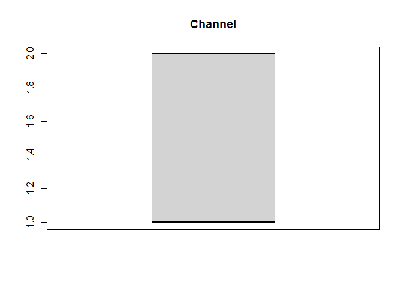<!-- -->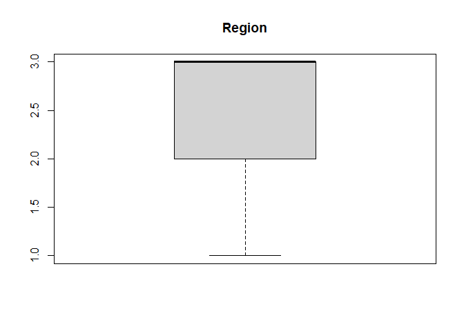<!-- -->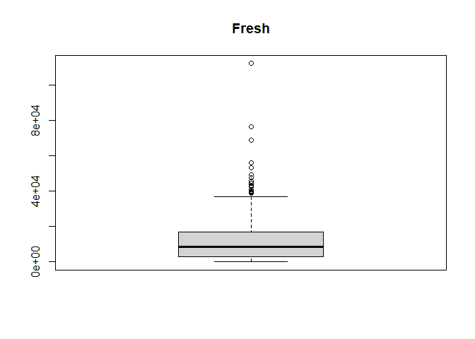<!-- --><!-- --><!-- -->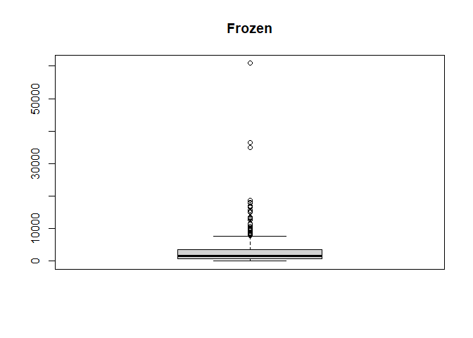<!-- -->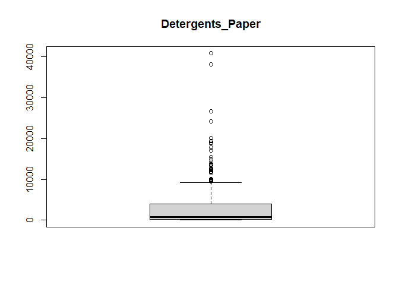<!-- -->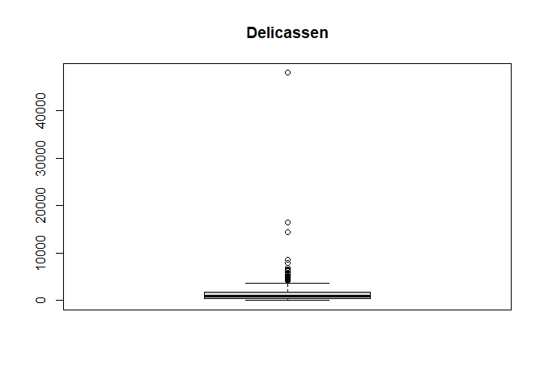<!-- -->

``` r
customers_data$Channel <- as.character(customers_data$Channel)

customers_data$Channel[customers_data$Channel == "1"] <- "restaurant"
customers_data$Channel[customers_data$Channel == "2"] <- "retail"
```

``` r
customers_data$Region <- as.character(customers_data$Region)

customers_data$Region[customers_data$Region == "1"] <- "Lisbon"
customers_data$Region[customers_data$Region == "2"] <- "Porto"
customers_data$Region[customers_data$Region == "3"] <- "Other region"
```

``` r
# Calculating the mean for all numeric columns

colMeans(data.num)
```

    ##          Channel           Region            Fresh             Milk 
    ##         1.322727         2.543182     12000.297727      5796.265909 
    ##          Grocery           Frozen Detergents_Paper       Delicassen 
    ##      7951.277273      3071.931818      2881.493182      1524.870455

``` r
for (i in 1:ncol(data.num)) {
  data.num[, i] <- as.numeric(unlist(data.num[, i]))
}
```

``` r
median(as.numeric(unlist(data.num[, 1])))
```

    ## [1] 1

``` r
for (i in 1:ncol(data.num)) {
  print(names(as.vector(data.num[, i])))
  print(median(as.numeric(unlist(data.num[, i]))))
  print("**************")
}
```

    ## [1] "Channel"
    ## [1] 1
    ## [1] "**************"
    ## [1] "Region"
    ## [1] 3
    ## [1] "**************"
    ## [1] "Fresh"
    ## [1] 8504
    ## [1] "**************"
    ## [1] "Milk"
    ## [1] 3627
    ## [1] "**************"
    ## [1] "Grocery"
    ## [1] 4755.5
    ## [1] "**************"
    ## [1] "Frozen"
    ## [1] 1526
    ## [1] "**************"
    ## [1] "Detergents_Paper"
    ## [1] 816.5
    ## [1] "**************"
    ## [1] "Delicassen"
    ## [1] 965.5
    ## [1] "**************"

``` r
getmode <- function(v) {
   uniqv <- unique(v)
   uniqv[which.max(tabulate(match(v, uniqv)))]
}
```

``` r
for (i in 1:ncol(customers_data)) {
  print(names(customers_data[, i]))
  print(getmode(customers_data[, i]))
}
```

    ## [1] "Channel"
    ## # A tibble: 2 x 1
    ##   Channel   
    ##   <chr>     
    ## 1 retail    
    ## 2 restaurant
    ## [1] "Region"
    ## # A tibble: 3 x 1
    ##   Region      
    ##   <chr>       
    ## 1 Other region
    ## 2 Lisbon      
    ## 3 Porto       
    ## [1] "Fresh"
    ## # A tibble: 433 x 1
    ##    Fresh
    ##    <dbl>
    ##  1 12669
    ##  2  7057
    ##  3  6353
    ##  4 13265
    ##  5 22615
    ##  6  9413
    ##  7 12126
    ##  8  7579
    ##  9  5963
    ## 10  6006
    ## # ... with 423 more rows
    ## [1] "Milk"
    ## # A tibble: 421 x 1
    ##     Milk
    ##    <dbl>
    ##  1  9656
    ##  2  9810
    ##  3  8808
    ##  4  1196
    ##  5  5410
    ##  6  8259
    ##  7  3199
    ##  8  4956
    ##  9  3648
    ## 10 11093
    ## # ... with 411 more rows
    ## [1] "Grocery"
    ## # A tibble: 430 x 1
    ##    Grocery
    ##      <dbl>
    ##  1    7561
    ##  2    9568
    ##  3    7684
    ##  4    4221
    ##  5    7198
    ##  6    5126
    ##  7    6975
    ##  8    9426
    ##  9    6192
    ## 10   18881
    ## # ... with 420 more rows
    ## [1] "Frozen"
    ## # A tibble: 426 x 1
    ##    Frozen
    ##     <dbl>
    ##  1    214
    ##  2   1762
    ##  3   2405
    ##  4   6404
    ##  5   3915
    ##  6    666
    ##  7    480
    ##  8   1669
    ##  9    425
    ## 10   1159
    ## # ... with 416 more rows
    ## [1] "Detergents_Paper"
    ## # A tibble: 417 x 1
    ##    Detergents_Paper
    ##               <dbl>
    ##  1             2674
    ##  2             3293
    ##  3             3516
    ##  4              507
    ##  5             1777
    ##  6             1795
    ##  7             3140
    ##  8             3321
    ##  9             1716
    ## 10             7425
    ## # ... with 407 more rows
    ## [1] "Delicassen"
    ## # A tibble: 403 x 1
    ##    Delicassen
    ##         <dbl>
    ##  1       1338
    ##  2       1776
    ##  3       7844
    ##  4       1788
    ##  5       5185
    ##  6       1451
    ##  7        545
    ##  8       2566
    ##  9        750
    ## 10       2098
    ## # ... with 393 more rows

``` r
# install.packages("matrixStats")
library(matrixStats)
```

    ## 
    ## Attaching package: 'matrixStats'

    ## The following object is masked from 'package:dplyr':
    ## 
    ##     count

``` r
for (i in 1:ncol(data.num)) {
  print(names(as.vector(data.num[, i])))
  print(min(as.numeric(unlist(data.num[, i]))))
  print("**************")
}
```

    ## [1] "Channel"
    ## [1] 1
    ## [1] "**************"
    ## [1] "Region"
    ## [1] 1
    ## [1] "**************"
    ## [1] "Fresh"
    ## [1] 3
    ## [1] "**************"
    ## [1] "Milk"
    ## [1] 55
    ## [1] "**************"
    ## [1] "Grocery"
    ## [1] 3
    ## [1] "**************"
    ## [1] "Frozen"
    ## [1] 25
    ## [1] "**************"
    ## [1] "Detergents_Paper"
    ## [1] 3
    ## [1] "**************"
    ## [1] "Delicassen"
    ## [1] 3
    ## [1] "**************"

``` r
for (i in 1:ncol(data.num)) {
  print(names(as.vector(data.num[, i])))
  print(max(as.numeric(unlist(data.num[, i]))))
  print("**************")
}
```

    ## [1] "Channel"
    ## [1] 2
    ## [1] "**************"
    ## [1] "Region"
    ## [1] 3
    ## [1] "**************"
    ## [1] "Fresh"
    ## [1] 112151
    ## [1] "**************"
    ## [1] "Milk"
    ## [1] 73498
    ## [1] "**************"
    ## [1] "Grocery"
    ## [1] 92780
    ## [1] "**************"
    ## [1] "Frozen"
    ## [1] 60869
    ## [1] "**************"
    ## [1] "Detergents_Paper"
    ## [1] 40827
    ## [1] "**************"
    ## [1] "Delicassen"
    ## [1] 47943
    ## [1] "**************"

``` r
lapply(data.num,FUN=quantile)
```

    ## $Channel
    ##   0%  25%  50%  75% 100% 
    ##    1    1    1    2    2 
    ## 
    ## $Region
    ##   0%  25%  50%  75% 100% 
    ##    1    2    3    3    3 
    ## 
    ## $Fresh
    ##        0%       25%       50%       75%      100% 
    ##      3.00   3127.75   8504.00  16933.75 112151.00 
    ## 
    ## $Milk
    ##       0%      25%      50%      75%     100% 
    ##    55.00  1533.00  3627.00  7190.25 73498.00 
    ## 
    ## $Grocery
    ##       0%      25%      50%      75%     100% 
    ##     3.00  2153.00  4755.50 10655.75 92780.00 
    ## 
    ## $Frozen
    ##       0%      25%      50%      75%     100% 
    ##    25.00   742.25  1526.00  3554.25 60869.00 
    ## 
    ## $Detergents_Paper
    ##       0%      25%      50%      75%     100% 
    ##     3.00   256.75   816.50  3922.00 40827.00 
    ## 
    ## $Delicassen
    ##       0%      25%      50%      75%     100% 
    ##     3.00   408.25   965.50  1820.25 47943.00

``` r
# Checking the range for all numeric columns

lapply(data.num,FUN=range)
```

    ## $Channel
    ## [1] 1 2
    ## 
    ## $Region
    ## [1] 1 3
    ## 
    ## $Fresh
    ## [1]      3 112151
    ## 
    ## $Milk
    ## [1]    55 73498
    ## 
    ## $Grocery
    ## [1]     3 92780
    ## 
    ## $Frozen
    ## [1]    25 60869
    ## 
    ## $Detergents_Paper
    ## [1]     3 40827
    ## 
    ## $Delicassen
    ## [1]     3 47943

``` r
for (i in 1:ncol(data.num)) {
  print(names(as.vector(data.num[, i])))
  print(var(as.numeric(unlist(data.num[, i]))))
  print("**************")
}
```

    ## [1] "Channel"
    ## [1] 0.2190723
    ## [1] "**************"
    ## [1] "Region"
    ## [1] 0.5994978
    ## [1] "**************"
    ## [1] "Fresh"
    ## [1] 159954927
    ## [1] "**************"
    ## [1] "Milk"
    ## [1] 54469967
    ## [1] "**************"
    ## [1] "Grocery"
    ## [1] 90310104
    ## [1] "**************"
    ## [1] "Frozen"
    ## [1] 23567853
    ## [1] "**************"
    ## [1] "Detergents_Paper"
    ## [1] 22732436
    ## [1] "**************"
    ## [1] "Delicassen"
    ## [1] 7952997
    ## [1] "**************"

``` r
for (i in 1:ncol(data.num)) {
  print(names(as.vector(data.num[, i])))
  print(sd(as.numeric(unlist(data.num[, i]))))
  print("**************")
}
```

    ## [1] "Channel"
    ## [1] 0.4680516
    ## [1] "**************"
    ## [1] "Region"
    ## [1] 0.7742724
    ## [1] "**************"
    ## [1] "Fresh"
    ## [1] 12647.33
    ## [1] "**************"
    ## [1] "Milk"
    ## [1] 7380.377
    ## [1] "**************"
    ## [1] "Grocery"
    ## [1] 9503.163
    ## [1] "**************"
    ## [1] "Frozen"
    ## [1] 4854.673
    ## [1] "**************"
    ## [1] "Detergents_Paper"
    ## [1] 4767.854
    ## [1] "**************"
    ## [1] "Delicassen"
    ## [1] 2820.106
    ## [1] "**************"

``` r
for (i in 1:ncol(data.num)) {
  hist(as.numeric(unlist(data.num[, i])))
}
```

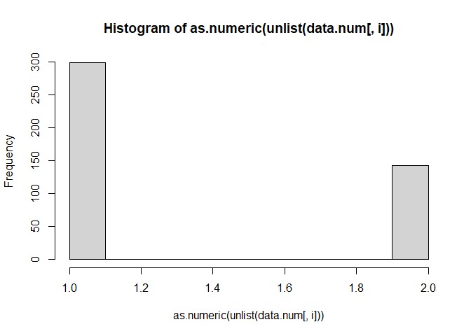<!-- -->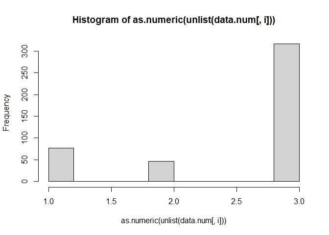<!-- -->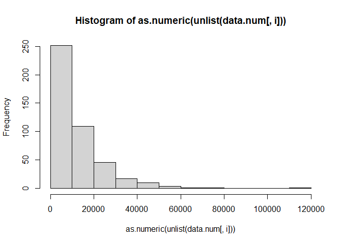<!-- -->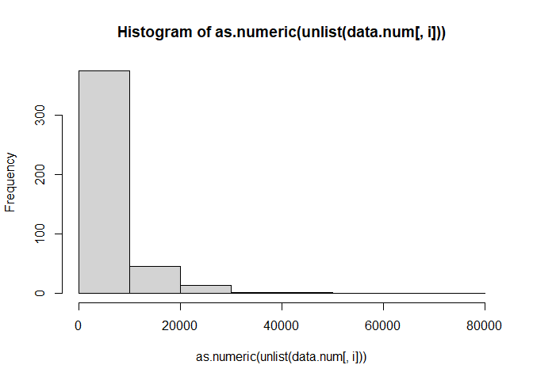<!-- -->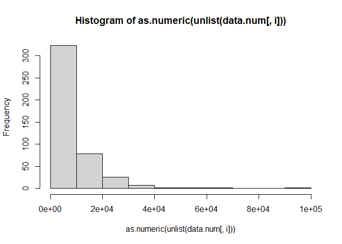<!-- -->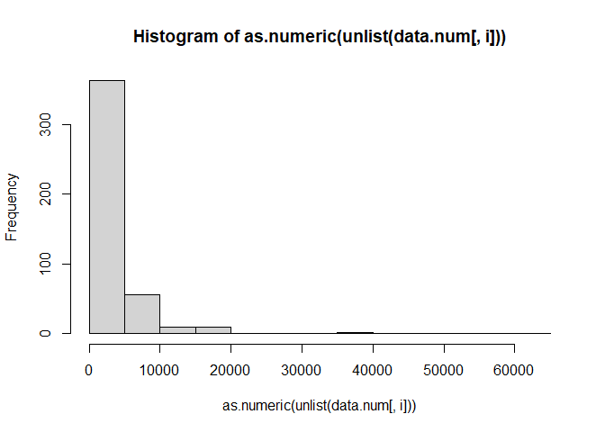<!-- -->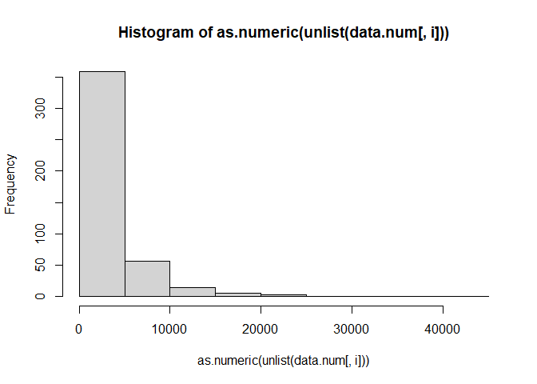<!-- -->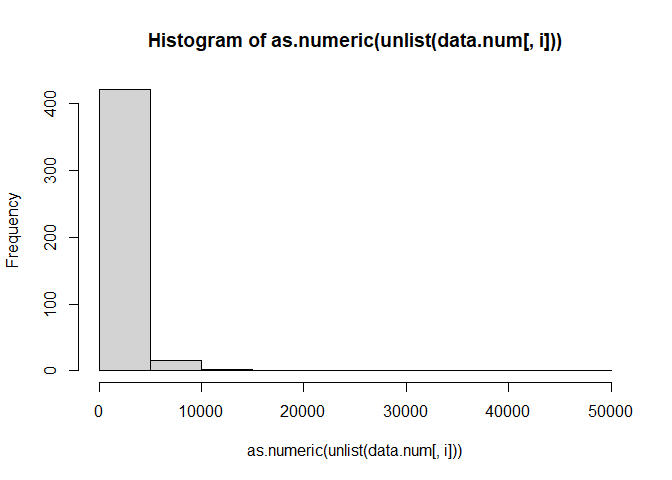<!-- -->
