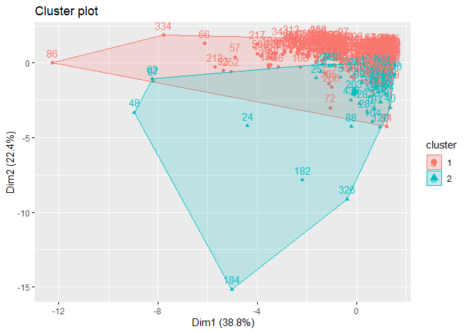

R Notebook
================

### Importing and reading dataset

``` r
library(readr)
customers_data_2<- read_csv("C:/Users/Admin/Downloads/Wholesale customers data.csv")
```

    ## 
    ## -- Column specification --------------------------------------------------------
    ## cols(
    ##   Channel = col_double(),
    ##   Region = col_double(),
    ##   Fresh = col_double(),
    ##   Milk = col_double(),
    ##   Grocery = col_double(),
    ##   Frozen = col_double(),
    ##   Detergents_Paper = col_double(),
    ##   Delicassen = col_double()
    ## )

``` r
#
# making dataframe copy
customers_data<-customers_data_2
#
#checking the fist 6 rows of the dataset.
head(customers_data)
```

    ## # A tibble: 6 x 8
    ##   Channel Region Fresh  Milk Grocery Frozen Detergents_Paper Delicassen
    ##     <dbl>  <dbl> <dbl> <dbl>   <dbl>  <dbl>            <dbl>      <dbl>
    ## 1       2      3 12669  9656    7561    214             2674       1338
    ## 2       2      3  7057  9810    9568   1762             3293       1776
    ## 3       2      3  6353  8808    7684   2405             3516       7844
    ## 4       1      3 13265  1196    4221   6404              507       1788
    ## 5       2      3 22615  5410    7198   3915             1777       5185
    ## 6       2      3  9413  8259    5126    666             1795       1451

### checking the bottom rows of the dataset

``` r
tail(customers_data)
```

    ## # A tibble: 6 x 8
    ##   Channel Region Fresh  Milk Grocery Frozen Detergents_Paper Delicassen
    ##     <dbl>  <dbl> <dbl> <dbl>   <dbl>  <dbl>            <dbl>      <dbl>
    ## 1       1      3 16731  3922    7994    688             2371        838
    ## 2       1      3 29703 12051   16027  13135              182       2204
    ## 3       1      3 39228  1431     764   4510               93       2346
    ## 4       2      3 14531 15488   30243    437            14841       1867
    ## 5       1      3 10290  1981    2232   1038              168       2125
    ## 6       1      3  2787  1698    2510     65              477         52

### getting the dataset summary

``` r
summary(customers_data)
```

    ##     Channel          Region          Fresh             Milk      
    ##  Min.   :1.000   Min.   :1.000   Min.   :     3   Min.   :   55  
    ##  1st Qu.:1.000   1st Qu.:2.000   1st Qu.:  3128   1st Qu.: 1533  
    ##  Median :1.000   Median :3.000   Median :  8504   Median : 3627  
    ##  Mean   :1.323   Mean   :2.543   Mean   : 12000   Mean   : 5796  
    ##  3rd Qu.:2.000   3rd Qu.:3.000   3rd Qu.: 16934   3rd Qu.: 7190  
    ##  Max.   :2.000   Max.   :3.000   Max.   :112151   Max.   :73498  
    ##     Grocery          Frozen        Detergents_Paper    Delicassen     
    ##  Min.   :    3   Min.   :   25.0   Min.   :    3.0   Min.   :    3.0  
    ##  1st Qu.: 2153   1st Qu.:  742.2   1st Qu.:  256.8   1st Qu.:  408.2  
    ##  Median : 4756   Median : 1526.0   Median :  816.5   Median :  965.5  
    ##  Mean   : 7951   Mean   : 3071.9   Mean   : 2881.5   Mean   : 1524.9  
    ##  3rd Qu.:10656   3rd Qu.: 3554.2   3rd Qu.: 3922.0   3rd Qu.: 1820.2  
    ##  Max.   :92780   Max.   :60869.0   Max.   :40827.0   Max.   :47943.0

### checking datatypes

``` r
str(customers_data)
```

    ## tibble [440 x 8] (S3: spec_tbl_df/tbl_df/tbl/data.frame)
    ##  $ Channel         : num [1:440] 2 2 2 1 2 2 2 2 1 2 ...
    ##  $ Region          : num [1:440] 3 3 3 3 3 3 3 3 3 3 ...
    ##  $ Fresh           : num [1:440] 12669 7057 6353 13265 22615 ...
    ##  $ Milk            : num [1:440] 9656 9810 8808 1196 5410 ...
    ##  $ Grocery         : num [1:440] 7561 9568 7684 4221 7198 ...
    ##  $ Frozen          : num [1:440] 214 1762 2405 6404 3915 ...
    ##  $ Detergents_Paper: num [1:440] 2674 3293 3516 507 1777 ...
    ##  $ Delicassen      : num [1:440] 1338 1776 7844 1788 5185 ...
    ##  - attr(*, "spec")=
    ##   .. cols(
    ##   ..   Channel = col_double(),
    ##   ..   Region = col_double(),
    ##   ..   Fresh = col_double(),
    ##   ..   Milk = col_double(),
    ##   ..   Grocery = col_double(),
    ##   ..   Frozen = col_double(),
    ##   ..   Detergents_Paper = col_double(),
    ##   ..   Delicassen = col_double()
    ##   .. )

### converting the data into a tibble for easy manupulation

``` r
library(caret)
```

    ## Loading required package: lattice

    ## Loading required package: ggplot2

``` r
library(tibble)
#For ease in analysis,we convert the data into a tibble
customers_data<-as_tibble(customers_data) # there is suggestion to use as_tibble instead of as.tibble.
head(customers_data)
```

    ## # A tibble: 6 x 8
    ##   Channel Region Fresh  Milk Grocery Frozen Detergents_Paper Delicassen
    ##     <dbl>  <dbl> <dbl> <dbl>   <dbl>  <dbl>            <dbl>      <dbl>
    ## 1       2      3 12669  9656    7561    214             2674       1338
    ## 2       2      3  7057  9810    9568   1762             3293       1776
    ## 3       2      3  6353  8808    7684   2405             3516       7844
    ## 4       1      3 13265  1196    4221   6404              507       1788
    ## 5       2      3 22615  5410    7198   3915             1777       5185
    ## 6       2      3  9413  8259    5126    666             1795       1451

\#\#. Data cleaning

``` r
#checking the missing values
is.null(customers_data)
```

    ## [1] FALSE

``` r
# checking for duplicates 
anyDuplicated(customers_data)
```

    ## [1] 0

### checking for outliers

### installing the packages.

``` r
# install.packages("magrittr") # package installations are only needed the first time you use it
# install.packages("dplyr")    # alternative installation of the %>%
library(magrittr) # needs to be run every time you start R and want to use %>%
library(dplyr)    # alternatively, this also loads %>%
```

    ## 
    ## Attaching package: 'dplyr'

    ## The following objects are masked from 'package:stats':
    ## 
    ##     filter, lag

    ## The following objects are masked from 'package:base':
    ## 
    ##     intersect, setdiff, setequal, union

## converting some clunms to categorical datatypes.

channel and Region are categorical in nature and not numerical, they
have already been encoded to make them easier to work with. We will
convert them to their appropriate data type.

``` r
##converting colunms to categorical datatypes
#
customers_df <-customers_data
customers_df$Channel  <- as.factor(customers_df$Channel)
customers_df$Region <- as.factor(customers_df$Region)
```

\#\#confirming the datatype changes

``` r
# confirming the data types changes
str(customers_df)
```

    ## tibble [440 x 8] (S3: tbl_df/tbl/data.frame)
    ##  $ Channel         : Factor w/ 2 levels "1","2": 2 2 2 1 2 2 2 2 1 2 ...
    ##  $ Region          : Factor w/ 3 levels "1","2","3": 3 3 3 3 3 3 3 3 3 3 ...
    ##  $ Fresh           : num [1:440] 12669 7057 6353 13265 22615 ...
    ##  $ Milk            : num [1:440] 9656 9810 8808 1196 5410 ...
    ##  $ Grocery         : num [1:440] 7561 9568 7684 4221 7198 ...
    ##  $ Frozen          : num [1:440] 214 1762 2405 6404 3915 ...
    ##  $ Detergents_Paper: num [1:440] 2674 3293 3516 507 1777 ...
    ##  $ Delicassen      : num [1:440] 1338 1776 7844 1788 5185 ...
    ##  - attr(*, "spec")=
    ##   .. cols(
    ##   ..   Channel = col_double(),
    ##   ..   Region = col_double(),
    ##   ..   Fresh = col_double(),
    ##   ..   Milk = col_double(),
    ##   ..   Grocery = col_double(),
    ##   ..   Frozen = col_double(),
    ##   ..   Detergents_Paper = col_double(),
    ##   ..   Delicassen = col_double()
    ##   .. )

the two variables has been transformed to categorical datatype.
\#\#\#3.2a Identifying the numeric class in the data and evaluating if
there are any outliers

``` r
#
#Checking the data types of the columns
#
data.num<- customers_df %>% select_if(is.numeric)
data.num
```

    ## # A tibble: 440 x 6
    ##    Fresh  Milk Grocery Frozen Detergents_Paper Delicassen
    ##    <dbl> <dbl>   <dbl>  <dbl>            <dbl>      <dbl>
    ##  1 12669  9656    7561    214             2674       1338
    ##  2  7057  9810    9568   1762             3293       1776
    ##  3  6353  8808    7684   2405             3516       7844
    ##  4 13265  1196    4221   6404              507       1788
    ##  5 22615  5410    7198   3915             1777       5185
    ##  6  9413  8259    5126    666             1795       1451
    ##  7 12126  3199    6975    480             3140        545
    ##  8  7579  4956    9426   1669             3321       2566
    ##  9  5963  3648    6192    425             1716        750
    ## 10  6006 11093   18881   1159             7425       2098
    ## # ... with 430 more rows

### checking for outliers

``` r
for (i in 1:ncol(data.num)) {
  boxplot(data.num[, i], main=names(data.num[, i]))
}
```

<!-- --><!-- --><!-- --><!-- --><!-- --><!-- -->
observation: all variables has outlies. However we will not dop them as
they look genuine. \#\#\# renaming the rows of the channel, and region
for analysis purpose.

``` r
library(caret)
library(lattice)
#customers_data$Channel <- as.factor(customers_data$Channel)
#customers_data$Channel[customers_data$Channel == "1"] <- "restaurant"
#customers_data$Channel[customers_data$Channel == "2"] <- "retail"
```

``` r
#customers_data$Region <- as.factor(customers_data$Region)
#customers_data$Region[customers_data$Region == "1"] <- "Lisbon"
#customers_data$Region[customers_data$Region == "2"] <- "Porto"
#customers_data$Region[customers_data$Region == "3"] <- "Other region"
```

\#\#\#renaming colunms for analysis purpose

``` r
library(dplyr)
customers_df$Channel <- with(customers_data,  factor(Channel, levels = c(1,2),labels = c("restaurant", "retail")))
customers_df$Region <- with(customers_data,  factor(Region, levels = c(1,2,3), labels = c("Lisbon", "Porto", "Other region")))
head(customers_df)
```

    ## # A tibble: 6 x 8
    ##   Channel    Region       Fresh  Milk Grocery Frozen Detergents_Paper Delicassen
    ##   <fct>      <fct>        <dbl> <dbl>   <dbl>  <dbl>            <dbl>      <dbl>
    ## 1 retail     Other region 12669  9656    7561    214             2674       1338
    ## 2 retail     Other region  7057  9810    9568   1762             3293       1776
    ## 3 retail     Other region  6353  8808    7684   2405             3516       7844
    ## 4 restaurant Other region 13265  1196    4221   6404              507       1788
    ## 5 retail     Other region 22615  5410    7198   3915             1777       5185
    ## 6 retail     Other region  9413  8259    5126    666             1795       1451

### confirming the rowname changes.

``` r
customers_df$Region
```

    ##   [1] Other region Other region Other region Other region Other region
    ##   [6] Other region Other region Other region Other region Other region
    ##  [11] Other region Other region Other region Other region Other region
    ##  [16] Other region Other region Other region Other region Other region
    ##  [21] Other region Other region Other region Other region Other region
    ##  [26] Other region Other region Other region Other region Other region
    ##  [31] Other region Other region Other region Other region Other region
    ##  [36] Other region Other region Other region Other region Other region
    ##  [41] Other region Other region Other region Other region Other region
    ##  [46] Other region Other region Other region Other region Other region
    ##  [51] Other region Other region Other region Other region Other region
    ##  [56] Other region Other region Other region Other region Other region
    ##  [61] Other region Other region Other region Other region Other region
    ##  [66] Other region Other region Other region Other region Other region
    ##  [71] Other region Other region Other region Other region Other region
    ##  [76] Other region Other region Other region Other region Other region
    ##  [81] Other region Other region Other region Other region Other region
    ##  [86] Other region Other region Other region Other region Other region
    ##  [91] Other region Other region Other region Other region Other region
    ##  [96] Other region Other region Other region Other region Other region
    ## [101] Other region Other region Other region Other region Other region
    ## [106] Other region Other region Other region Other region Other region
    ## [111] Other region Other region Other region Other region Other region
    ## [116] Other region Other region Other region Other region Other region
    ## [121] Other region Other region Other region Other region Other region
    ## [126] Other region Other region Other region Other region Other region
    ## [131] Other region Other region Other region Other region Other region
    ## [136] Other region Other region Other region Other region Other region
    ## [141] Other region Other region Other region Other region Other region
    ## [146] Other region Other region Other region Other region Other region
    ## [151] Other region Other region Other region Other region Other region
    ## [156] Other region Other region Other region Other region Other region
    ## [161] Other region Other region Other region Other region Other region
    ## [166] Other region Other region Other region Other region Other region
    ## [171] Other region Other region Other region Other region Other region
    ## [176] Other region Other region Other region Other region Other region
    ## [181] Other region Other region Other region Other region Other region
    ## [186] Other region Other region Other region Other region Other region
    ## [191] Other region Other region Other region Other region Other region
    ## [196] Other region Lisbon       Lisbon       Lisbon       Lisbon      
    ## [201] Lisbon       Lisbon       Lisbon       Lisbon       Lisbon      
    ## [206] Lisbon       Lisbon       Lisbon       Lisbon       Lisbon      
    ## [211] Lisbon       Lisbon       Lisbon       Lisbon       Lisbon      
    ## [216] Lisbon       Lisbon       Lisbon       Lisbon       Lisbon      
    ## [221] Lisbon       Lisbon       Lisbon       Lisbon       Lisbon      
    ## [226] Lisbon       Lisbon       Lisbon       Lisbon       Lisbon      
    ## [231] Lisbon       Lisbon       Lisbon       Lisbon       Lisbon      
    ## [236] Lisbon       Lisbon       Lisbon       Lisbon       Lisbon      
    ## [241] Lisbon       Lisbon       Lisbon       Lisbon       Lisbon      
    ## [246] Lisbon       Lisbon       Lisbon       Lisbon       Lisbon      
    ## [251] Lisbon       Lisbon       Lisbon       Lisbon       Lisbon      
    ## [256] Lisbon       Lisbon       Lisbon       Lisbon       Lisbon      
    ## [261] Lisbon       Lisbon       Lisbon       Lisbon       Lisbon      
    ## [266] Lisbon       Lisbon       Lisbon       Lisbon       Lisbon      
    ## [271] Lisbon       Lisbon       Lisbon       Other region Other region
    ## [276] Other region Other region Other region Other region Other region
    ## [281] Other region Other region Other region Other region Other region
    ## [286] Other region Other region Other region Other region Other region
    ## [291] Other region Other region Other region Porto        Porto       
    ## [296] Porto        Porto        Porto        Porto        Porto       
    ## [301] Porto        Porto        Porto        Porto        Porto       
    ## [306] Porto        Porto        Porto        Porto        Porto       
    ## [311] Porto        Porto        Porto        Porto        Porto       
    ## [316] Porto        Porto        Porto        Porto        Porto       
    ## [321] Porto        Porto        Porto        Porto        Porto       
    ## [326] Porto        Porto        Porto        Porto        Porto       
    ## [331] Porto        Porto        Porto        Porto        Porto       
    ## [336] Porto        Porto        Porto        Porto        Porto       
    ## [341] Other region Other region Other region Other region Other region
    ## [346] Other region Other region Other region Other region Other region
    ## [351] Other region Other region Other region Other region Other region
    ## [356] Other region Other region Other region Other region Other region
    ## [361] Other region Other region Other region Other region Other region
    ## [366] Other region Other region Other region Other region Other region
    ## [371] Other region Other region Other region Other region Other region
    ## [376] Other region Other region Other region Other region Other region
    ## [381] Other region Other region Other region Other region Other region
    ## [386] Other region Other region Other region Other region Other region
    ## [391] Other region Other region Other region Other region Other region
    ## [396] Other region Other region Other region Other region Other region
    ## [401] Other region Other region Other region Other region Other region
    ## [406] Other region Other region Other region Other region Other region
    ## [411] Other region Other region Other region Other region Other region
    ## [416] Other region Other region Other region Other region Other region
    ## [421] Other region Other region Other region Other region Other region
    ## [426] Other region Other region Other region Other region Other region
    ## [431] Other region Other region Other region Other region Other region
    ## [436] Other region Other region Other region Other region Other region
    ## Levels: Lisbon Porto Other region

\#\#\#checking dataset summary after data cleaning

``` r
# getting the main summary
summary(customers_df)
```

    ##        Channel             Region        Fresh             Milk      
    ##  restaurant:298   Lisbon      : 77   Min.   :     3   Min.   :   55  
    ##  retail    :142   Porto       : 47   1st Qu.:  3128   1st Qu.: 1533  
    ##                   Other region:316   Median :  8504   Median : 3627  
    ##                                      Mean   : 12000   Mean   : 5796  
    ##                                      3rd Qu.: 16934   3rd Qu.: 7190  
    ##                                      Max.   :112151   Max.   :73498  
    ##     Grocery          Frozen        Detergents_Paper    Delicassen     
    ##  Min.   :    3   Min.   :   25.0   Min.   :    3.0   Min.   :    3.0  
    ##  1st Qu.: 2153   1st Qu.:  742.2   1st Qu.:  256.8   1st Qu.:  408.2  
    ##  Median : 4756   Median : 1526.0   Median :  816.5   Median :  965.5  
    ##  Mean   : 7951   Mean   : 3071.9   Mean   : 2881.5   Mean   : 1524.9  
    ##  3rd Qu.:10656   3rd Qu.: 3554.2   3rd Qu.: 3922.0   3rd Qu.: 1820.2  
    ##  Max.   :92780   Max.   :60869.0   Max.   :40827.0   Max.   :47943.0

\#\#getting the dataset description

``` r
library(psych)
```

    ## 
    ## Attaching package: 'psych'

    ## The following objects are masked from 'package:ggplot2':
    ## 
    ##     %+%, alpha

``` r
describe(customers_df)
```

    ##                  vars   n     mean       sd median trimmed     mad min    max
    ## Channel*            1 440     1.32     0.47    1.0    1.28    0.00   1      2
    ## Region*             2 440     2.54     0.77    3.0    2.68    0.00   1      3
    ## Fresh               3 440 12000.30 12647.33 8504.0 9864.61 8776.25   3 112151
    ## Milk                4 440  5796.27  7380.38 3627.0 4375.52 3647.20  55  73498
    ## Grocery             5 440  7951.28  9503.16 4755.5 6158.43 4586.42   3  92780
    ## Frozen              6 440  3071.93  4854.67 1526.0 2144.07 1607.88  25  60869
    ## Detergents_Paper    7 440  2881.49  4767.85  816.5 1849.73 1060.80   3  40827
    ## Delicassen          8 440  1524.87  2820.11  965.5 1113.24  945.16   3  47943
    ##                   range  skew kurtosis     se
    ## Channel*              1  0.76    -1.43   0.02
    ## Region*               2 -1.27    -0.13   0.04
    ## Fresh            112148  2.54    11.33 602.94
    ## Milk              73443  4.03    24.25 351.85
    ## Grocery           92777  3.56    20.56 453.05
    ## Frozen            60844  5.87    53.80 231.44
    ## Detergents_Paper  40824  3.61    18.68 227.30
    ## Delicassen        47940 11.08   167.97 134.44

observation: it gives us the a glimpse of the mean,variance,max and so
on. \#\# Univariate Analysis \#\#\# univariate Analysis for Numerical
data

``` r
#preview of the numerical colunms
#
library(dplyr)    # alternatively, this also loads %>%
head(data.num)
```

    ## # A tibble: 6 x 6
    ##   Fresh  Milk Grocery Frozen Detergents_Paper Delicassen
    ##   <dbl> <dbl>   <dbl>  <dbl>            <dbl>      <dbl>
    ## 1 12669  9656    7561    214             2674       1338
    ## 2  7057  9810    9568   1762             3293       1776
    ## 3  6353  8808    7684   2405             3516       7844
    ## 4 13265  1196    4221   6404              507       1788
    ## 5 22615  5410    7198   3915             1777       5185
    ## 6  9413  8259    5126    666             1795       1451

### previewing the numerical variables using histograms to check skewness.

``` r
#3.3ai installing ggplot2 package for visualization.
#install.packages('ggplot2')
#
#installing ggplot2 library
#
library(ggplot2)
#
#note: the above  have been installed in the console section.
```

``` r
#visualizing the Fresh  colunm to check for skewness
#
qplot(data = customers_df, x = Fresh)
```

    ## `stat_bin()` using `bins = 30`. Pick better value with `binwidth`.

<!-- -->

``` r
#visualizing the milk colunm to check for skewness
#
qplot(data = customers_df, x = Milk,)
```

    ## `stat_bin()` using `bins = 30`. Pick better value with `binwidth`.

<!-- -->

``` r
#visualizing the grocery  colunm to check for skewness
#
qplot(data = customers_df, x = Grocery)
```

    ## `stat_bin()` using `bins = 30`. Pick better value with `binwidth`.

<!-- -->

``` r
#visualizing the Frozen  colunm to check for skewness
#
qplot(data = customers_df, x = Frozen)
```

    ## `stat_bin()` using `bins = 30`. Pick better value with `binwidth`.

<!-- -->

``` r
#visualizing the Detergents_Paper colunm to check for skewness
#
qplot(data = customers_df, x = Detergents_Paper)
```

    ## `stat_bin()` using `bins = 30`. Pick better value with `binwidth`.

<!-- -->

``` r
#visualizing the Delicassen  column to check for skewness
#
qplot(data = customers_data, x = Delicassen)
```

    ## `stat_bin()` using `bins = 30`. Pick better value with `binwidth`.

<!-- -->
observation: All our numerical variables have are positively skewed.
\#\#\# we can check skewness for numerical values at once as below

``` r
## we can check skewness for numerical values at once as below
library(caret)
library(ggplot2)
library(dplyr)    # alternatively, this also loads %>%
library(tidyr)
```

    ## 
    ## Attaching package: 'tidyr'

    ## The following object is masked from 'package:magrittr':
    ## 
    ##     extract

``` r
customers_df%>%
  gather(attributes, value, 3:8) %>%
  ggplot(aes(x = value)) +
  geom_histogram(fill = 'lightblue2', color = 'black') +
  facet_wrap(~attributes, scales = 'free_x') +
  labs(x="Values", y="Frequency") +
  theme_bw()
```

    ## `stat_bin()` using `bins = 30`. Pick better value with `binwidth`.

<!-- -->
observation: shows skewness to the right(positive skewness). \#\#\# 4.1b
univariate Analysis for categorical Data

``` r
## Identifying the categorical class in the data 
#
df_cat<- customers_df %>% select_if(is.factor)
df_cat
```

    ## # A tibble: 440 x 2
    ##    Channel    Region      
    ##    <fct>      <fct>       
    ##  1 retail     Other region
    ##  2 retail     Other region
    ##  3 retail     Other region
    ##  4 restaurant Other region
    ##  5 retail     Other region
    ##  6 retail     Other region
    ##  7 retail     Other region
    ##  8 retail     Other region
    ##  9 restaurant Other region
    ## 10 retail     Other region
    ## # ... with 430 more rows

## creating tables for bar plots.

``` r
# create tables of all categorical variables to be able to create bar plots with them
Channel_table <- table(customers_df$Channel)
Region_table <- table(customers_df$Region)
```

### adjusting plot size bf plotting.

``` r
# function for adjusting plot size
set_plot_dimensions <- function(width_choice, height_choice) {
    options(repr.plot.width = width_choice, repr.plot.height = height_choice)
}
```

``` r
# barplot of Month
set_plot_dimensions(5, 4)
Channel_table
```

    ## 
    ## restaurant     retail 
    ##        298        142

``` r
barplot(Channel_table, ylab = "count", xlab="Channel", col="dark red")
```

<!-- -->
observation: restaurant has more records compared to retail variable.

``` r
# barplot of Month
set_plot_dimensions(5, 4)
Region_table
```

    ## 
    ##       Lisbon        Porto Other region 
    ##           77           47          316

``` r
barplot(Region_table, ylab = "count", xlab="Region", col="sky blue")
```

<!-- -->
observation:other region has more records followed by Lisbon city, and
finally Porto. \#\# Bivariate Analysis we will use

``` r
head(data.num)
```

    ## # A tibble: 6 x 6
    ##   Fresh  Milk Grocery Frozen Detergents_Paper Delicassen
    ##   <dbl> <dbl>   <dbl>  <dbl>            <dbl>      <dbl>
    ## 1 12669  9656    7561    214             2674       1338
    ## 2  7057  9810    9568   1762             3293       1776
    ## 3  6353  8808    7684   2405             3516       7844
    ## 4 13265  1196    4221   6404              507       1788
    ## 5 22615  5410    7198   3915             1777       5185
    ## 6  9413  8259    5126    666             1795       1451

``` r
for (i in 1:ncol(data.num)) {
  for (j in 1:ncol(data.num)) {
    if(i!=j){
       plot(as.numeric(unlist(data.num[, j]))
, as.numeric(unlist(data.num[, i]))
, xlab = names(as.vector(data.num[, i]))
, ylab = names(as.vector(data.num[, j])))
    }
  
  }
}
```

<!-- --><!-- --><!-- --><!-- --><!-- --><!-- --><!-- --><!-- --><!-- --><!-- --><!-- --><!-- --><!-- --><!-- --><!-- --><!-- --><!-- --><!-- --><!-- --><!-- --><!-- --><!-- --><!-- --><!-- --><!-- --><!-- --><!-- --><!-- --><!-- --><!-- -->

``` r
#scatterplot 
plot(customers_data$Fresh, customers_data$Grocery,main = "Fresh vs Grocery scatterplot", xlab = "Fresh", ylab = "Grocery"  )
```

<!-- -->
observation: Most transactions are contrated at 0, meaning customers
don’t buy products.

``` r
head(customers_df)
```

    ## # A tibble: 6 x 8
    ##   Channel    Region       Fresh  Milk Grocery Frozen Detergents_Paper Delicassen
    ##   <fct>      <fct>        <dbl> <dbl>   <dbl>  <dbl>            <dbl>      <dbl>
    ## 1 retail     Other region 12669  9656    7561    214             2674       1338
    ## 2 retail     Other region  7057  9810    9568   1762             3293       1776
    ## 3 retail     Other region  6353  8808    7684   2405             3516       7844
    ## 4 restaurant Other region 13265  1196    4221   6404              507       1788
    ## 5 retail     Other region 22615  5410    7198   3915             1777       5185
    ## 6 retail     Other region  9413  8259    5126    666             1795       1451

``` r
ggplot(customers_data, aes(Region, Milk)) +
  geom_col()
```

<!-- -->

``` r
for (i in 3:ncol(customers_data)) {
  ggplot(customers_data, aes(Region, names(as.vector(customers_data[, i]))))+geom_col()
  
}
```

``` r
library(ggplot2)
ggplot(customers_data, aes(Region, names(as.vector(customers_data[, 3]))
)) +
  geom_col()
```

<!-- -->
\#FEATURE SELECTION. Filter Method

``` r
head(data.num)
```

    ## # A tibble: 6 x 6
    ##   Fresh  Milk Grocery Frozen Detergents_Paper Delicassen
    ##   <dbl> <dbl>   <dbl>  <dbl>            <dbl>      <dbl>
    ## 1 12669  9656    7561    214             2674       1338
    ## 2  7057  9810    9568   1762             3293       1776
    ## 3  6353  8808    7684   2405             3516       7844
    ## 4 13265  1196    4221   6404              507       1788
    ## 5 22615  5410    7198   3915             1777       5185
    ## 6  9413  8259    5126    666             1795       1451

``` r
library(caret)
library(corrplot)
```

    ## corrplot 0.84 loaded

``` r
#correlation matrix
wholesale.cor <- cor(data.num)
highlycor <- findCorrelation(wholesale.cor, cutoff = 0.75)
highlycor      #highly correlated variables
```

    ## [1] 3

``` r
#name of highly 
names(data.num[, highlycor]) # Grocery
```

    ## [1] "Grocery"

``` r
#Removing Redundant Features
df <- data.num[-highlycor]
head(df)
```

    ## # A tibble: 6 x 5
    ##   Fresh  Milk Frozen Detergents_Paper Delicassen
    ##   <dbl> <dbl>  <dbl>            <dbl>      <dbl>
    ## 1 12669  9656    214             2674       1338
    ## 2  7057  9810   1762             3293       1776
    ## 3  6353  8808   2405             3516       7844
    ## 4 13265  1196   6404              507       1788
    ## 5 22615  5410   3915             1777       5185
    ## 6  9413  8259    666             1795       1451

``` r
#comparing before and after 
par(mfrow = c(1, 2))
corrplot(wholesale.cor, order = "hclust")
corrplot(cor(df), order = "hclust")
```

<!-- --> \#\#\#
plotting correlation of the numerical variables..

``` r
#install.packages("corrplot") 
library(corrplot)
#
## Let’s build a correlation matrix to understand the relation between each attributes
corrplot(cor(df), type = 'upper', method = 'number', tl.cex = 0.9)
```

<!-- --> \#\#
clustering \#\#\# k\_mean clustering the dataset isn’t that big, thus we
will use k means method. \#\#\# confirmating all the datatypes are
numerical

``` r
str(df)
```

    ## tibble [440 x 5] (S3: tbl_df/tbl/data.frame)
    ##  $ Fresh           : num [1:440] 12669 7057 6353 13265 22615 ...
    ##  $ Milk            : num [1:440] 9656 9810 8808 1196 5410 ...
    ##  $ Frozen          : num [1:440] 214 1762 2405 6404 3915 ...
    ##  $ Detergents_Paper: num [1:440] 2674 3293 3516 507 1777 ...
    ##  $ Delicassen      : num [1:440] 1338 1776 7844 1788 5185 ...
    ##  - attr(*, "spec")=
    ##   .. cols(
    ##   ..   Channel = col_double(),
    ##   ..   Region = col_double(),
    ##   ..   Fresh = col_double(),
    ##   ..   Milk = col_double(),
    ##   ..   Grocery = col_double(),
    ##   ..   Frozen = col_double(),
    ##   ..   Detergents_Paper = col_double(),
    ##   ..   Delicassen = col_double()
    ##   .. )

``` r
# dataset summary
#
summary(df)
```

    ##      Fresh             Milk           Frozen        Detergents_Paper 
    ##  Min.   :     3   Min.   :   55   Min.   :   25.0   Min.   :    3.0  
    ##  1st Qu.:  3128   1st Qu.: 1533   1st Qu.:  742.2   1st Qu.:  256.8  
    ##  Median :  8504   Median : 3627   Median : 1526.0   Median :  816.5  
    ##  Mean   : 12000   Mean   : 5796   Mean   : 3071.9   Mean   : 2881.5  
    ##  3rd Qu.: 16934   3rd Qu.: 7190   3rd Qu.: 3554.2   3rd Qu.: 3922.0  
    ##  Max.   :112151   Max.   :73498   Max.   :60869.0   Max.   :40827.0  
    ##    Delicassen     
    ##  Min.   :    3.0  
    ##  1st Qu.:  408.2  
    ##  Median :  965.5  
    ##  Mean   : 1524.9  
    ##  3rd Qu.: 1820.2  
    ##  Max.   :47943.0

our dataset is in different dimension.we will scale it before we do
clustering

``` r
# normalizing our dataset by use of scale function.
#
library(dplyr)
df_Normalize <- as.data.frame(scale(df))
#
#previewing the scaled dataset.
head(df_Normalize)
```

    ##         Fresh        Milk     Frozen Detergents_Paper  Delicassen
    ## 1  0.05287300  0.52297247 -0.5886970      -0.04351919 -0.06626363
    ## 2 -0.39085706  0.54383861 -0.2698290       0.08630859  0.08904969
    ## 3 -0.44652098  0.40807319 -0.1373793       0.13308016  2.24074190
    ## 4  0.09999758 -0.62331041  0.6863630      -0.49802132  0.09330484
    ## 5  0.83928412 -0.05233688  0.1736612      -0.23165413  1.29786952
    ## 6 -0.20457266  0.33368675 -0.4955909      -0.22787885 -0.02619421

observation: our data has been scaled and is now on the same scale.
\#\#\# getting the optimal clusters using elbow method. \#\#\#installing
the packages to be used

``` r
library(factoextra)
```

    ## Welcome! Want to learn more? See two factoextra-related books at https://goo.gl/ve3WBa

``` r
library(cluster)
library(gridExtra) # for grid.arrange
```

    ## 
    ## Attaching package: 'gridExtra'

    ## The following object is masked from 'package:dplyr':
    ## 
    ##     combine

``` r
library(dplyr)
```

### elbow method

``` r
# Determining Optimal clusters (k) Using Elbow method
fviz_nbclust(x = df_Normalize,FUNcluster = kmeans, method = 'wss' )
```

<!-- -->
observation: elbow methods gives 2 as the optimal cluster, we will check
other methods. \#\#\# silhouette method

``` r
# Determining Optimal clusters (k) Using Average Silhouette Method
fviz_nbclust(x = df_Normalize,FUNcluster = kmeans, method = 'silhouette' )
```

<!-- -->
observation; silhouette method chooses 3 as optimal cluster. There is
another method called Gap-Static used for finding the optimal value of
K.

``` r
library(factoextra)
library(cluster)
# compute gap statistic
set.seed(1234)
gap_stat <- clusGap(x = df_Normalize, FUN = kmeans, K.max = 15, nstart = 25,iter.max=100)
# Print the result
print(gap_stat, method = "firstmax")
```

    ## Clustering Gap statistic ["clusGap"] from call:
    ## clusGap(x = df_Normalize, FUNcluster = kmeans, K.max = 15, nstart = 25,     iter.max = 100)
    ## B=100 simulated reference sets, k = 1..15; spaceH0="scaledPCA"
    ##  --> Number of clusters (method 'firstmax'): 1
    ##           logW   E.logW      gap      SE.sim
    ##  [1,] 5.548652 7.129865 1.581213 0.009219731
    ##  [2,] 5.449888 6.995793 1.545905 0.009991787
    ##  [3,] 5.384440 6.922024 1.537584 0.009804606
    ##  [4,] 5.261183 6.859947 1.598764 0.009421083
    ##  [5,] 5.145344 6.808299 1.662955 0.009489560
    ##  [6,] 5.096112 6.763149 1.667037 0.009795126
    ##  [7,] 5.037667 6.722761 1.685094 0.009570377
    ##  [8,] 4.973473 6.687051 1.713578 0.009486315
    ##  [9,] 4.937628 6.656072 1.718444 0.010033475
    ## [10,] 4.892399 6.628184 1.735785 0.010190786
    ## [11,] 4.839106 6.601789 1.762683 0.010451775
    ## [12,] 4.815152 6.577865 1.762713 0.010595444
    ## [13,] 4.785596 6.556162 1.770566 0.010839477
    ## [14,] 4.748170 6.535631 1.787461 0.010797960
    ## [15,] 4.708260 6.516785 1.808525 0.010884256

\#visualizing to get the optimal cluster

``` r
# plot the result to determine the optimal number of clusters.
fviz_gap_stat(gap_stat)
```

<!-- --> gap
statistics method gives as 3 as the optimal cluster.

``` r
# Compute k-means clustering with k = 2, optimal cluster
set.seed(123)
kmean_df <- kmeans(customers_data, centers = 3, nstart = 25)
print(kmean_df)
```

    ## K-means clustering with 3 clusters of sizes 330, 50, 60
    ## 
    ## Cluster means:
    ##    Channel   Region    Fresh      Milk   Grocery   Frozen Detergents_Paper
    ## 1 1.260606 2.554545  8253.47  3824.603  5280.455 2572.661         1773.058
    ## 2 1.960000 2.440000  8000.04 18511.420 27573.900 1996.680        12407.360
    ## 3 1.133333 2.566667 35941.40  6044.450  6288.617 6713.967         1039.667
    ##   Delicassen
    ## 1   1137.497
    ## 2   2252.020
    ## 3   3049.467
    ## 
    ## Clustering vector:
    ##   [1] 1 1 1 1 3 1 1 1 1 2 1 1 3 1 3 1 1 1 1 1 1 1 3 2 3 1 1 1 2 3 1 1 1 3 1 1 3
    ##  [38] 1 2 3 3 1 1 2 1 2 2 2 1 2 1 1 3 1 3 1 2 1 1 1 1 2 1 1 1 2 1 1 1 1 1 1 1 1
    ##  [75] 1 1 1 2 1 1 1 1 1 1 1 2 2 3 1 3 1 1 2 1 1 1 1 1 1 1 1 1 1 3 1 1 1 1 1 2 1
    ## [112] 2 1 1 1 1 1 1 1 1 1 1 1 1 3 3 1 1 1 3 1 1 1 1 1 1 1 1 1 1 1 3 3 1 1 2 1 1
    ## [149] 1 3 1 1 1 1 1 2 1 1 1 1 1 1 1 2 1 2 1 1 1 1 1 2 1 2 1 1 3 1 1 1 1 3 1 3 1
    ## [186] 1 1 1 1 1 1 1 1 1 1 1 3 1 1 1 2 2 3 1 1 2 1 1 1 2 1 2 1 1 1 1 2 1 1 1 1 1
    ## [223] 1 1 1 1 1 1 1 1 1 1 3 1 1 1 1 1 1 3 3 3 1 1 1 1 1 1 1 1 1 2 1 3 1 3 1 1 3
    ## [260] 3 1 1 3 1 1 2 2 1 2 1 1 1 1 3 1 1 3 1 1 1 1 1 3 3 3 3 1 1 1 3 1 1 1 1 1 1
    ## [297] 1 1 1 1 1 2 1 1 2 1 2 1 1 2 1 3 2 1 1 1 1 1 1 2 1 1 1 1 3 3 1 1 1 1 1 2 1
    ## [334] 2 1 3 1 1 1 1 1 1 1 2 1 1 1 3 1 2 1 2 1 2 1 1 1 1 1 1 1 1 1 1 1 1 1 1 1 1
    ## [371] 3 1 1 1 1 1 1 3 1 1 3 1 3 1 2 1 1 1 1 1 1 1 1 3 1 1 1 1 1 1 1 3 3 3 1 1 3
    ## [408] 2 1 1 1 1 1 1 1 1 1 1 2 1 1 1 3 1 1 1 1 3 1 1 1 1 1 1 1 3 3 2 1 1
    ## 
    ## Within cluster sum of squares by cluster:
    ## [1] 28184319111 26382784712 25765310355
    ##  (between_SS / total_SS =  49.0 %)
    ## 
    ## Available components:
    ## 
    ## [1] "cluster"      "centers"      "totss"        "withinss"     "tot.withinss"
    ## [6] "betweenss"    "size"         "iter"         "ifault"

We can visualize the results using the below code.

``` r
library(factoextra)
library(cluster)
fviz_cluster(kmean_df, data = customers_data)
```

<!-- --> these
are the 2 optimal clusters.

``` r
head(kmean_df)
```

    ## $cluster
    ##   [1] 1 1 1 1 3 1 1 1 1 2 1 1 3 1 3 1 1 1 1 1 1 1 3 2 3 1 1 1 2 3 1 1 1 3 1 1 3
    ##  [38] 1 2 3 3 1 1 2 1 2 2 2 1 2 1 1 3 1 3 1 2 1 1 1 1 2 1 1 1 2 1 1 1 1 1 1 1 1
    ##  [75] 1 1 1 2 1 1 1 1 1 1 1 2 2 3 1 3 1 1 2 1 1 1 1 1 1 1 1 1 1 3 1 1 1 1 1 2 1
    ## [112] 2 1 1 1 1 1 1 1 1 1 1 1 1 3 3 1 1 1 3 1 1 1 1 1 1 1 1 1 1 1 3 3 1 1 2 1 1
    ## [149] 1 3 1 1 1 1 1 2 1 1 1 1 1 1 1 2 1 2 1 1 1 1 1 2 1 2 1 1 3 1 1 1 1 3 1 3 1
    ## [186] 1 1 1 1 1 1 1 1 1 1 1 3 1 1 1 2 2 3 1 1 2 1 1 1 2 1 2 1 1 1 1 2 1 1 1 1 1
    ## [223] 1 1 1 1 1 1 1 1 1 1 3 1 1 1 1 1 1 3 3 3 1 1 1 1 1 1 1 1 1 2 1 3 1 3 1 1 3
    ## [260] 3 1 1 3 1 1 2 2 1 2 1 1 1 1 3 1 1 3 1 1 1 1 1 3 3 3 3 1 1 1 3 1 1 1 1 1 1
    ## [297] 1 1 1 1 1 2 1 1 2 1 2 1 1 2 1 3 2 1 1 1 1 1 1 2 1 1 1 1 3 3 1 1 1 1 1 2 1
    ## [334] 2 1 3 1 1 1 1 1 1 1 2 1 1 1 3 1 2 1 2 1 2 1 1 1 1 1 1 1 1 1 1 1 1 1 1 1 1
    ## [371] 3 1 1 1 1 1 1 3 1 1 3 1 3 1 2 1 1 1 1 1 1 1 1 3 1 1 1 1 1 1 1 3 3 3 1 1 3
    ## [408] 2 1 1 1 1 1 1 1 1 1 1 2 1 1 1 3 1 1 1 1 3 1 1 1 1 1 1 1 3 3 2 1 1
    ## 
    ## $centers
    ##    Channel   Region    Fresh      Milk   Grocery   Frozen Detergents_Paper
    ## 1 1.260606 2.554545  8253.47  3824.603  5280.455 2572.661         1773.058
    ## 2 1.960000 2.440000  8000.04 18511.420 27573.900 1996.680        12407.360
    ## 3 1.133333 2.566667 35941.40  6044.450  6288.617 6713.967         1039.667
    ##   Delicassen
    ## 1   1137.497
    ## 2   2252.020
    ## 3   3049.467
    ## 
    ## $totss
    ## [1] 157595857525
    ## 
    ## $withinss
    ## [1] 28184319111 26382784712 25765310355
    ## 
    ## $tot.withinss
    ## [1] 80332414178
    ## 
    ## $betweenss
    ## [1] 77263443347

``` r
# Verifying the results of clustering
# ---
# 
par(mfrow = c(2,2), mar = c(5,4,2,2))
# Plotting to see how Sepal.Length and Sepal.Width data points have been distributed in clusters
plot(customers_data[c(3,5)], col = kmean_df$cluster)
plot(customers_data[c(4,5)], col = kmean_df$cluster)
plot(customers_data[c(3,4)], col = kmean_df$cluster)
plot(customers_data[c(5,6)], col = kmean_df$cluster)
```

<!-- -->

``` r
# Plotting to see how Sepal.Length and Sepal.Width data points have been distributed 
# originally as per "class" attribute in dataset
# ---
```

``` r
# showing how the clusters respond to the region variable
table(kmean_df$cluster, customers_df$Region)
```

    ##    
    ##     Lisbon Porto Other region
    ##   1     56    35          239
    ##   2     10     8           32
    ##   3     11     4           45

### We can extract the clusters and add to our initial data to do some descriptive statistics at the cluster level

``` r
library(tidyr)
#customers_df %>% 
 # mutate(Cluster = kmean_df$cluster) %>%
 # group_by(Cluster) %>%
 # summarize_all('median')
```

``` r
# Cluster size
kmean_df$size
```

    ## [1] 330  50  60

### using pca

## 4.0 Creating a dataset for PCA

``` r
# Selecting the numerical data (excluding the categorical variables)
# ---
df_new<-customers_df[,c(3:8)]
df_new
```

    ## # A tibble: 440 x 6
    ##    Fresh  Milk Grocery Frozen Detergents_Paper Delicassen
    ##    <dbl> <dbl>   <dbl>  <dbl>            <dbl>      <dbl>
    ##  1 12669  9656    7561    214             2674       1338
    ##  2  7057  9810    9568   1762             3293       1776
    ##  3  6353  8808    7684   2405             3516       7844
    ##  4 13265  1196    4221   6404              507       1788
    ##  5 22615  5410    7198   3915             1777       5185
    ##  6  9413  8259    5126    666             1795       1451
    ##  7 12126  3199    6975    480             3140        545
    ##  8  7579  4956    9426   1669             3321       2566
    ##  9  5963  3648    6192    425             1716        750
    ## 10  6006 11093   18881   1159             7425       2098
    ## # ... with 430 more rows

``` r
# normalizing our dataset by use of scale function.
#
#library(dplyr)
df_Norm <- as.data.frame(scale(df_new))
#
#previewing the scaled dataset.
head(df_Norm)
```

    ##         Fresh        Milk     Grocery     Frozen Detergents_Paper  Delicassen
    ## 1  0.05287300  0.52297247 -0.04106815 -0.5886970      -0.04351919 -0.06626363
    ## 2 -0.39085706  0.54383861  0.17012470 -0.2698290       0.08630859  0.08904969
    ## 3 -0.44652098  0.40807319 -0.02812509 -0.1373793       0.13308016  2.24074190
    ## 4  0.09999758 -0.62331041 -0.39253008  0.6863630      -0.49802132  0.09330484
    ## 5  0.83928412 -0.05233688 -0.07926595  0.1736612      -0.23165413  1.29786952
    ## 6 -0.20457266  0.33368675 -0.29729863 -0.4955909      -0.22787885 -0.02619421

``` r
#We then pass pca_numeric to the prcomp(). We also set one arguments, scale, 
# to be TRUE then preview our object with summary
pca_customer <- prcomp(df_new[,c(1:6)], center = TRUE, scale. = TRUE)
summary(pca_customer)
```

    ## Importance of components:
    ##                           PC1    PC2    PC3     PC4     PC5    PC6
    ## Standard deviation     1.6263 1.3048 0.8603 0.75082 0.53449 0.2509
    ## Proportion of Variance 0.4408 0.2838 0.1233 0.09396 0.04761 0.0105
    ## Cumulative Proportion  0.4408 0.7246 0.8479 0.94189 0.98950 1.0000

### we can plot the principal components for visualization using plot(), and type.

``` r
plot(pca_customer,type = 'l')
```

<!-- -->

``` r
# Calling str() to have a look at your PCA object
# ---
# 
str(pca_customer)
```

    ## List of 5
    ##  $ sdev    : num [1:6] 1.626 1.305 0.86 0.751 0.534 ...
    ##  $ rotation: num [1:6, 1:6] -0.0429 -0.5451 -0.5793 -0.0512 -0.5486 ...
    ##   ..- attr(*, "dimnames")=List of 2
    ##   .. ..$ : chr [1:6] "Fresh" "Milk" "Grocery" "Frozen" ...
    ##   .. ..$ : chr [1:6] "PC1" "PC2" "PC3" "PC4" ...
    ##  $ center  : Named num [1:6] 12000 5796 7951 3072 2881 ...
    ##   ..- attr(*, "names")= chr [1:6] "Fresh" "Milk" "Grocery" "Frozen" ...
    ##  $ scale   : Named num [1:6] 12647 7380 9503 4855 4768 ...
    ##   ..- attr(*, "names")= chr [1:6] "Fresh" "Milk" "Grocery" "Frozen" ...
    ##  $ x       : num [1:440, 1:6] -0.193 -0.434 -0.81 0.778 -0.166 ...
    ##   ..- attr(*, "dimnames")=List of 2
    ##   .. ..$ : NULL
    ##   .. ..$ : chr [1:6] "PC1" "PC2" "PC3" "PC4" ...
    ##  - attr(*, "class")= chr "prcomp"

\#\#visualizing our pca

``` r
library(ggbiplot)
```

    ## Loading required package: plyr

    ## ------------------------------------------------------------------------------

    ## You have loaded plyr after dplyr - this is likely to cause problems.
    ## If you need functions from both plyr and dplyr, please load plyr first, then dplyr:
    ## library(plyr); library(dplyr)

    ## ------------------------------------------------------------------------------

    ## 
    ## Attaching package: 'plyr'

    ## The following objects are masked from 'package:dplyr':
    ## 
    ##     arrange, count, desc, failwith, id, mutate, rename, summarise,
    ##     summarize

    ## Loading required package: scales

    ## 
    ## Attaching package: 'scales'

    ## The following objects are masked from 'package:psych':
    ## 
    ##     alpha, rescale

    ## The following object is masked from 'package:readr':
    ## 
    ##     col_factor

    ## Loading required package: grid

``` r
# We will now plot our pca. This will provide us with some very useful insights i.e. 
# which  are most similar to each other.
ggbiplot(pca_customer, scale =0.4)
```

<!-- --> \#\#
selecting PC1 and PC2,PC3 for ploting

``` r
#we want to include other colunms to be plotted as well
pca_customer1 <- cbind(customers_df,pca_customer$x[,1:3])
head(pca_customer1)
```

    ##      Channel       Region Fresh Milk Grocery Frozen Detergents_Paper Delicassen
    ## 1     retail Other region 12669 9656    7561    214             2674       1338
    ## 2     retail Other region  7057 9810    9568   1762             3293       1776
    ## 3     retail Other region  6353 8808    7684   2405             3516       7844
    ## 4 restaurant Other region 13265 1196    4221   6404              507       1788
    ## 5     retail Other region 22615 5410    7198   3915             1777       5185
    ## 6     retail Other region  9413 8259    5126    666             1795       1451
    ##          PC1        PC2         PC3
    ## 1 -0.1930708  0.3047531 -0.14071827
    ## 2 -0.4339260  0.3280392  0.31864390
    ## 3 -0.8102210 -0.8141689  1.52168348
    ## 4  0.7777625 -0.6520115  0.16282692
    ## 5 -0.1660982 -1.2699881  0.06620403
    ## 6  0.1559924  0.2948054  0.14744411

## plotting PC1 and PC2 to check the products by grouping based on gender.

``` r
ggplot(pca_customer1,aes(PC1,PC2, col=Product.line,fill=Channel))+
 stat_ellipse(geom = "polygon",col='green',alpha=1)+
 geom_point(col='black',shape=24)
```

<!-- --> \#\#\#
Hierarchical clustering \#\#\# Agglomerative Nesting (Hierarchical
Clustering) using euclidean we will use the rescaled dataset
df\_Normalized for hierarchical clustering.

``` r
head(df_Norm)
```

    ##         Fresh        Milk     Grocery     Frozen Detergents_Paper  Delicassen
    ## 1  0.05287300  0.52297247 -0.04106815 -0.5886970      -0.04351919 -0.06626363
    ## 2 -0.39085706  0.54383861  0.17012470 -0.2698290       0.08630859  0.08904969
    ## 3 -0.44652098  0.40807319 -0.02812509 -0.1373793       0.13308016  2.24074190
    ## 4  0.09999758 -0.62331041 -0.39253008  0.6863630      -0.49802132  0.09330484
    ## 5  0.83928412 -0.05233688 -0.07926595  0.1736612      -0.23165413  1.29786952
    ## 6 -0.20457266  0.33368675 -0.29729863 -0.4955909      -0.22787885 -0.02619421

``` r
library(cluster)
# First we use the dist() function to compute the Euclidean distance between observations, 
# res.hc will be the first argument in the hclust() function dissimilarity matrix
# ---
# first we compute the euclidean distance using euclidean metric
eucl_dist<- dist(df_Norm, method = "euclidean")
```

``` r
# checking euclidean distance in matrix form 
as.matrix(eucl_dist)[1:6, 1:6]
```

    ##           1         2        3        4        5         6
    ## 1 0.0000000 0.6201520 2.412450 1.815908 1.851574 0.4604609
    ## 2 0.6201520 0.0000000 2.170333 1.781998 1.920911 0.6784641
    ## 3 2.4124496 2.1703326 0.000000 2.680215 1.728199 2.3524738
    ## 4 1.8159083 1.7819984 2.680215 0.000000 1.659964 1.5817546
    ## 5 1.8515740 1.9209106 1.728199 1.659964 0.000000 1.8674171
    ## 6 0.4604609 0.6784641 2.352474 1.581755 1.867417 0.0000000

this is the euclidean distance of our dataset.

``` r
# then we compute hierarchical clustering using the Ward method
res_hcl <- hclust(eucl_dist, method =  "ward.D2")
res_hcl
```

    ## 
    ## Call:
    ## hclust(d = eucl_dist, method = "ward.D2")
    ## 
    ## Cluster method   : ward.D2 
    ## Distance         : euclidean 
    ## Number of objects: 440

## we plot the dendogram

``` r
# Lastly, we plot the obtained dendrogram
# ---
# 
plot(res_hcl, cex = 0.6,  hang = -1)
```

<!-- -->
\#\#\#Cut the dendrogram into different groups

``` r
#One of the problems with hierarchical clustering is that, it does not tell us how many clusters there #are, or where to cut the dendrogram to form clusters
# Cut the tree visualizing
# we will get 10 clusters
fviz_dend(res_hcl, cex = 0.5, k = 3, rect = TRUE, color_labels_by_k = TRUE)
```

<!-- -->

``` r
# Cut tree into 3 groups
grp <- cutree(res_hcl, k = 3)
head(grp, n = 3)
```

    ## [1] 1 1 1

``` r
# Number of data points in each cluster
table(grp)
```

    ## grp
    ##   1   2   3 
    ## 153 281   6

### Agglomerative (Hierarchical Clustering) using manhattan method

``` r
# We now use the R function hclust() for hierarchical clustering
# ---
# 
# First we use the dist() function to compute the Euclidean distance between observations, 
# d will be the first argument in the hclust() function dissimilarity matrix
# ---
# first we compute the manhattan distance using manhattan metric
#
man_distance <-dist(df_Norm,method= "manhattan")
```

``` r
#
as.matrix(man_distance)[1:6, 1:6]
```

    ##          1        2        3        4        5        6
    ## 1 0.000000 1.279798 3.562159 3.434000 3.714545 1.020497
    ## 2 1.279798 0.000000 2.720593 3.765436 4.045980 1.519053
    ## 3 3.562159 2.720593 0.000000 5.544588 3.416003 3.571615
    ## 4 3.434000 3.765436 5.544588 0.000000 3.607158 2.928394
    ## 5 3.714545 4.045980 3.416003 3.607158 0.000000 3.645004
    ## 6 1.020497 1.519053 3.571615 2.928394 3.645004 0.000000

``` r
# We then hierarchical clustering using the Ward's method
# ---
# 
man_hc <- hclust(man_distance)
man_hc
```

    ## 
    ## Call:
    ## hclust(d = man_distance)
    ## 
    ## Cluster method   : complete 
    ## Distance         : manhattan 
    ## Number of objects: 440

``` r
# Lastly, we plot the obtained dendrogram
# ---
# 
plot(man_hc, cex = 0.6, hang = -1)
```

<!-- -->

``` r
### Enhanced Visualization of Dendrogram
# Cut the tree
library(factoextra)
library("ggplot2")
fviz_dend(man_hc, cex = 0.5, k = 3,rect=TRUE, color_labels_by_k = TRUE)
```

<!-- -->

``` r
# Number of data points in each cluster
table(grp)
```

    ## grp
    ##   1   2   3 
    ## 153 281   6

this is the number of data points when we use manhattan conclusion: the
methods of Agglomerate hirarchy yields difference number of datapoints
in each clusters. this is because euclidean uses squared errors where as
manhattan looks at absolute values
